# Viability checks: stroke-and-nib models of four scribes

Four hands are tested:

- an early Hijazi Qur'an (BnF Arabe 328, below),
- a 15th-century Latin humanist cursive
  ([Lucretius](#second-sample-latin-humanist-cursive-lucretius)),
- a 14th-century Italian Gothic book hand
  ([Chig. L.VIII.305](#third-sample-italian-gothic-textualis-chig-lviii305)), and
- a 15th-century French Book of Hours in textura
  ([Clermont-Ferrand MS 2262](#fourth-sample-french-textura-clermont-ferrand-ms-2262)),
  studied letter by letter.

The [comparison](#the-four-hands-compared) at the end puts them side by side.

## Hijazi: one scribe's الله

**Question.** Can a model that *writes* letters, with a pen following stroke paths,
reproduce a real early Qur'anic hand? Can it also vary the way the scribe varied,
instead of repeating one fixed glyph the way a font does?

**Test material.** One page of BnF Arabe 328 (Hijazi script, Sūrat al-Baqarah
2:282–286), the 1024 × 1392 px image from Gallica. Every الله on the page was traced:
9 full instances, plus two لله on line 11. One of those is the second half of a والله
the scribe split across lines 10/11. That gives 11 instances.

**Short answer: viable.** The pen model redraws every instance to within about one scan
pixel. The measurements are reproducible from rough clicks, and the scribe's variation
turns out to be structured, so it can be modelled. Details and limits below.

## How it works

| Step | File | What it does |
|---|---|---|
| Ink | `ink.py` | Separates ink from parchment, water stains and the mirrored show-through from the other side of the leaf. Each pixel is compared with the local parchment brightness. |
| Trace | `data/traces_allah.json`, `../tools/tracer/` | For each word, a rough click at the top and foot of the alif, both lāms, the hā' and the baseline. |
| Measure | `measure.py` | Snaps each rough stroke onto the ink, re-fits it as a straight shaft, finds the baseline and the hā' loop, and outputs 11 features per word. |
| Pen | `nib.py` | Estimates the nib from about 17,000 stroke-width samples across the whole page. |
| Render | `pen.py`, `ductus.py` | Sweeps an elliptical nib along stroke centre-lines and outputs a vector outline (SVG). `ductus.py` is the stroke plan for الله, driven by the measured features. |
| Check | `run.py` | Runs everything and writes figures and numbers to `out/`. |

```sh
pip install -r requirements.txt
python3 run.py          # ~2 minutes; writes out/
```

## Results

### 1. The pen: an almost even-width reed

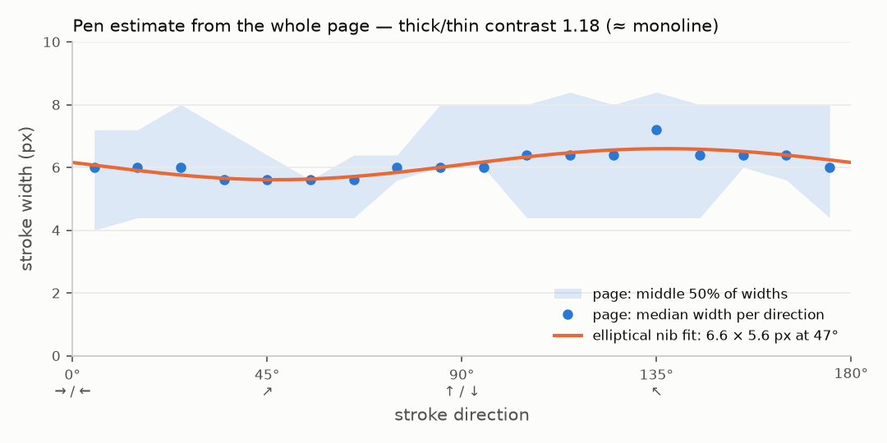

Stroke width hardly depends on direction. An elliptical nib of **6.6 × 5.6 px held at
47°** fits the page to within 0.19 px, giving a **thick/thin contrast of 1.18**. For
comparison, a broad-edge pen for Naskh or textura is roughly 5–10.

Horizontal strokes come out about 8% heavier than the slanted shafts (6.2 vs 5.7 px).
The reading I gave earlier from the image alone was right. This hand's character lies
in shapes, proportions and spacing, not in thick/thin modulation.

### 2. The model redraws every instance to within about a pixel

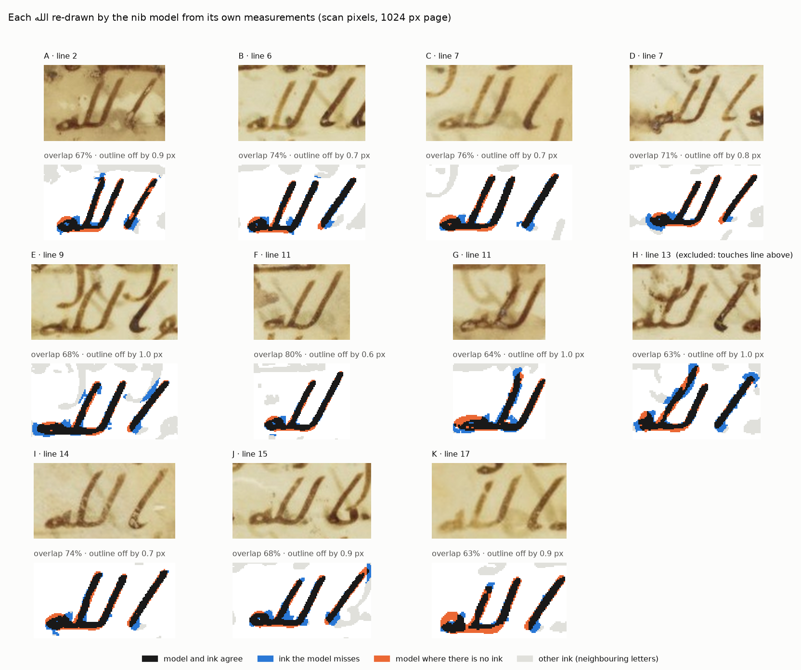

Each word was rebuilt from its own 11 measurements and the page-wide nib, then laid
over its ink:

- **Average outline error: 0.57–1.04 px** against a stroke width of 5.5 px.
- **Overlap: 63–80%.** At this stroke width a one-pixel shift on each side already
  costs about a third of the overlap, so the outline distance is the more telling
  number.

The remaining error is at the scan's resolution limit. Ink from neighbouring letters
that touches the word (shown in grey in the figure) is left out of the score, since
separating it is a segmentation problem, not a pen-model question.

### 3. Measurements are stable; the variation is the scribe's

A real repeatability test was run: every click was moved by random noise (SD 2.5 px)
and each word was re-measured 12 times.

| Feature | n | Mean | Scribe's SD | Range | Measurement noise SD |
|---|---:|---:|---:|---:|---:|
| alif height | 7 | 42.6 px (7.8 sw) | 3.1 px | 36.5–46.8 | 1.4 |
| lām¹ height | 10 | 41.7 px (7.6 sw) | 4.4 px | 35.4–51.3 | 1.0 |
| lām² height | 10 | 40.4 px (7.4 sw) | 5.0 px | 28.9–47.9 | 2.2 |
| alif slant | 7 | 34.4° | 2.5° | 30.8–37.9° | 0.3 |
| lām¹ slant | 10 | 25.3° | 2.0° | 21.5–28.2° | 0.1 |
| lām² slant | 10 | 24.9° | 3.5° | 19.4–30.2° | 0.5 |
| alif → lām¹ gap | 7 | 23.3 px (4.3 sw) | 1.8 px | 20.6–26.1 | 0.2 |
| lām¹ → lām² spacing | 10 | 18.9 px (3.4 sw) | 2.6 px | 14.0–23.1 | 0.2 |
| lām² → end of hā' | 9 | 24.4 px (4.5 sw) | 2.7 px | 22.2–30.5 | 0.6 |
| hā' height | 9 | 12.1 px (2.2 sw) | 1.2 px | 9.5–13.5 | 0.7 |
| hā' width | 9 | 17.6 px (3.2 sw) | 1.9 px | 16.0–22.0 | 0.5 |

*sw* = stroke widths (5.5 px), the scale-free unit. Slants are measured from vertical,
top leaning right.

- **Measurement noise is small next to the variation.** Slants and spacings are 5–40×
  smaller than the scribe's spread. Heights are the weakest case at 2–4× smaller,
  because the top of a stroke is where a click matters most.
- **A rule a font would not know.** In every one of the 7 words with a free alif, the
  alif leans further than both lāms, by 9° on average (34° vs 25°).
- **Moderate variation.** The scribe's variation is 7–14% of each size and 2–3.5° of
  slant.

### 4. The variation is shared across the word

Each letter was predicted only from the *other* letters of the same word
(leave-one-out), so no letter can explain itself:

- **Size is shared by the whole word.** The alif's height correlates with the average
  lām height of the same word at r = 0.97 (n = 7). Each lām's height correlates with
  the rest of its word at r ≈ 0.63 (n = 10). The whole word's size varies with an SD of
  about 9.5%.
- **Slant is partly shared.** Correlations are 0.38–0.72, and the word's slant varies
  with an SD of 2.3°.

This is the structured variation the earlier discussion predicted. A big part of the
"handmade" look is that a whole word comes out a little larger, or leans a little more,
not that each letter wobbles on its own.

### 5. Generating new instances

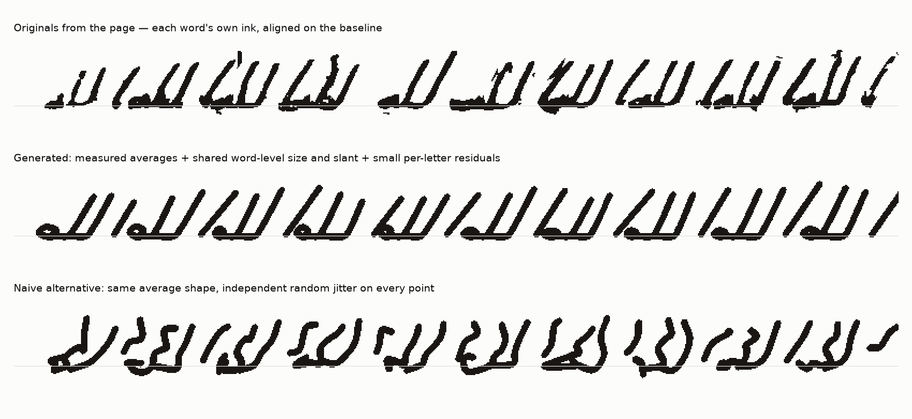

- **Top row: the originals.**
- **Middle row: generated words.** Each is sampled from the measured averages, plus a
  shared size and slant per word, plus small per-letter residuals, and drawn with the
  page's nib.
- **Bottom row: the naive alternative.** The same average shape with independent
  random jitter on every point, at the same amount of positional spread (3.3 px). It
  produces kinked shafts no reed would draw.

The middle row stays inside the scribe's range and keeps the straight, confident
shafts. Vector versions are in `out/allah_mean.svg` and `out/allah_variants.svg`.

## Limits of this check

- **Resolution.** At 1024 px a stroke is about 5.5 px wide, so nib shape, stroke ends
  (the reed's cut) and ink pooling can't be measured. The model draws round ends; the
  originals look blunter. The full-resolution Gallica scan (blocked from this
  environment) would fix this. The pipeline doesn't depend on the scale.
- **Sample size.** 7–10 values per feature are enough to show structure, but not to
  pin down correlations precisely. Two hints in the data need more pages before they
  count as findings:
  - The line-end word (K) is the smallest.
  - The word continuing a line-split (F) has the tallest first lām.
- **One word, one template.** The stroke plan for الله was written by hand. The hā'
  loop is a generic teardrop, and the alif-to-lām joins are simplified. Other letters
  need their own plans, and a single connector model is needed for joining.
- **Ink texture is not modelled.** Ink-cycle fading and edge roughness are not part of
  the model. They are a separate rendering layer and were deliberately left out here.

## Exclusions (from the flags in `data/traces_allah.json`)

- **H (line 13):** its lām² and alif run into the line above, so heights can't be
  separated at this resolution. It is shown in the fit figure but left out of all
  statistics.
- **J (بالله):** the alif is joined to the preceding bā', which is a different letter
  form. It is left out of the alif statistics.
- **G (لله ما):** the hā' touches the next letter. It is left out of the hā'
  statistics.
- **F, G:** these have no alif of their own.

## Next steps this supports

1. **More data.** Trace the remaining folios of Arabe 328 with `tools/tracer` to get
   n ≈ 50–100 per letter, ideally at full resolution.
2. **Joining.** Add stroke plans for the other letter forms and one connector model,
   then render a whole line from Unicode text.
3. **Line context.** Add the line-level layer: spacing between connected letter groups,
   stretched joins and line breaks. Then test whether position in the line explains
   the leftover variation.

## Second sample: Latin humanist cursive (Lucretius)

**Test material.** The opening page of a 15th-century humanist manuscript of Lucretius,
*De rerum natura* I.1–25 (`data/lucretius-drn-1r.jpg`, 1443 × 2000 px). It has a title
in epigraphic capitals with Greek, 24 lines of text, and an "Amerbachiorum" ex-libris
at the foot.

`data/lucretius_reading.json` holds the reading from the printed edition, split at the
manuscript's own line breaks:

- The manuscript **omits** the line *Illecebrisque tuis omnis natura animantum* (I.15),
  so its line 14 runs straight on to *Te sequitur cupide…*.
- The scribe abbreviates heavily (p with a stroke for *per/pre*, *q;* for *-que*, a
  macron for *m/n*) and writes *u* for *v* and *e* for *ae*. So the reading shows what
  the text *says*, and a separate "diplomatic" field records what the scribe *wrote*.
  That field is filled in only where it was checked against the image (line 24 and
  the title lines). The rest is left for tracing.

| Step | File | What it does |
|---|---|---|
| Lines | `latin_lines.py` | Finds every line's baseline and x-height line from the ink, plus ascender and descender reach, slant and pen; writes `data/lucretius_lines.json`. |
| Trace | `../tools/tracer/` (Lucretius sample) | Pick a letter in the reading, then click each stroke in writing order; the path between clicks follows the ink (`inkpath.py`). |
| Letters | `measure_letters.py` | Measures traced letters in x-heights, re-draws them with the page's pen, and compares the result with the ink. |

```sh
python3 latin_lines.py       # guides + line figures
python3 measure_letters.py   # traced letters (data/traces_lucretius.json)
```

### What the page shows

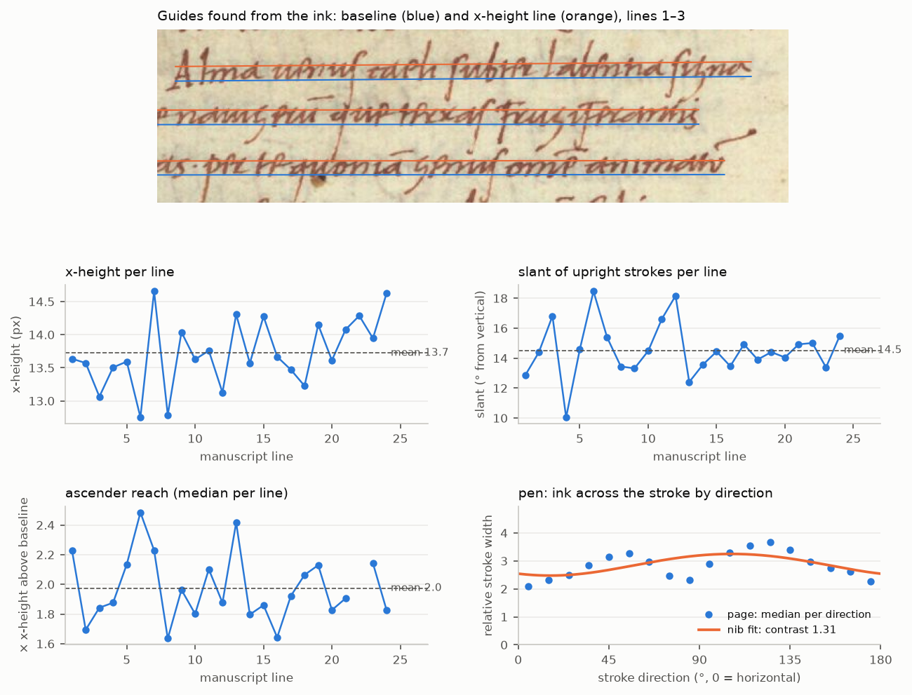

- **Guides found automatically.** All 24 text lines and 4 of the 5 title lines were
  found. The fifth, the one-word Greek ΦΥϹΕΩϹ, is too short to register.
- **Proportions:**
  - x-height: 13.7 ± 0.5 px.
  - Line spacing: 46 px (3.4 x-heights).
  - Ascenders: about 2.0 x-heights above the baseline.
  - Descenders: about 1.5 x-heights below.
  - Upright strokes: 14.8° from vertical.
  - Lines: level (−0.1° ± 0.2°).
- **No line-to-line drift.** Each line's left half was measured separately from its
  right half:
  - Slant: the halves agree only weakly (r = 0.31).
  - x-height: they don't agree at all (r = −0.07).

  So the differences between lines are mostly noise. This scribe keeps size and slant
  steady across the page, and the visible variation lives *within* lines. That is the
  opposite of the Hijazi page, where variation was shared by whole words.
- **Pen.** Strokes are only about 4 px wide here, too coarse to count pixels, so width
  is measured as the amount of ink across each stroke. The same method on the Hijazi
  page gives 1.18 at 44°, agreeing with the pixel method above.
  - Thick/thin contrast is only about 1.3, and no single nib angle fits well.
  - There are two thin directions: horizontal, and close to the upright slant.
  - The likely reason is that in a cursive hand the upstrokes are written lighter than
    the downstrokes at the same angle. A direction-only measurement can't separate the
    two, but traced strokes can, because they record which way the pen moved.

### Traced letters

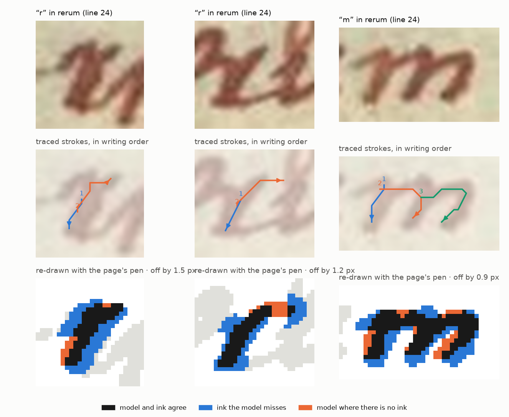

Three letters of *rerum* (line 24) are traced as seeds: both r's and the m. Re-drawn
with the page's pen, their outlines are 0.9–1.5 px from the ink.

Along these strokes, downstrokes come out heavier than upstrokes (4.2 vs 3.6 px), as
the pen analysis predicts. With 31 samples from three letters this is a hint, not a
result. The e and u of the same word are left untraced: a descender from line 23
crosses them, and their ductus can't be read with confidence at this resolution.

### What this means

- The tracing and measuring pipeline carries over from Arabic to Latin unchanged in
  structure. Line guides replace the per-word baseline, and strokes become polylines in
  writing order.
- For a cursive Latin hand the pen model needs a **pressure channel**. It must know
  whether a stroke is an upstroke or a downstroke, not only its angle. The tracer
  already records this.
- Size and slant can be held constant per line for this scribe. The variation model
  belongs at word and letter level.
- The editor's text layer needs an **abbreviation step** between the reading and the
  letters to be drawn (*per* → ꝑ, *-que* → q;, *-um* → ū). Otherwise a rendered line
  will spell out what the scribe abbreviated.
- Next step: trace a few lines in full, ideally on a full-resolution scan, to get
  10–20 instances per common letter. Then build the first stroke plans for this
  alphabet from them.

## Third sample: Italian Gothic textualis (Chig. L.VIII.305)

**What and where.** The page is **Città del Vaticano, Biblioteca Apostolica Vaticana,
Chig. L.VIII.305, f. 1r**, the opening page of the *Chigi canzoniere*. It is a
Florentine/Tuscan anthology of the *stilnovo* poets, usually dated to the middle of the
14th century. The image is a detail cropped at the right (`data/chigi-L-VIII-305-f1r.webp`).

The identification rests on five pieces of evidence:

1. **Library.** The diagonal watermark "…Apostolica Vaticana" is the one the Vatican
   Library puts on its digital images.
2. **Text.** It is Guido Guinizzelli's canzone *Tegno de folle 'mpresa, a lo ver
   dire*, stanzas 1–2 and the start of 3. It matches Contini's edition line for line
   (`data/chigi_reading.json`). Dante cites this canzone in *De vulgari eloquentia*.
3. **Rubric.** The red rubric reads *Mess[er] Guido guinizelli da bolong[na]*. Naming
   the poet's city marks a compilation made *outside* Bologna.
4. **Which Vatican manuscript.** Both Vatican songbooks that carry this canzone were
   considered:
   - **Vat. lat. 3793**, the other great early canzoniere, is written in mercantesca
     and chancery hands with plain black initials, so it is excluded.
   - **The Chigi codex** opens its Guinizzelli section on f. 1r with a large
     decorated T of *Tegno de folle*, described in the Vatican's catalogue notes as
     blue and red with red and violet filigree. That is exactly the initial on this
     page.
5. **Script and spelling.** The script is an Italian Gothic textualis: upright, with
   rounded bowls, the uncial *d*, and the long *ſ* standing on the line. The spelling
   is Tuscan scribal: *ç* for *z* (*força*), *ngn* for the palatal *n* (*disdengnosa*,
   *bolongna*), and the Latinizing *inlecto*.

**Readings worth noting** (from this image, before checking a facsimile):

- Line 5 reads *quando uuol **far** usar força*, where the edition has *quando vuol usar
  forza*.
- Line 10 keeps Guinizzelli's Bolognese *plu* (*chelaplu bella*), as the edition does.
- The verses run on like prose, separated by a slash-like virgula.
- The stanza ends with *:* (line 9), and the next stanza opens with a larger,
  red-touched B.

### What the page shows

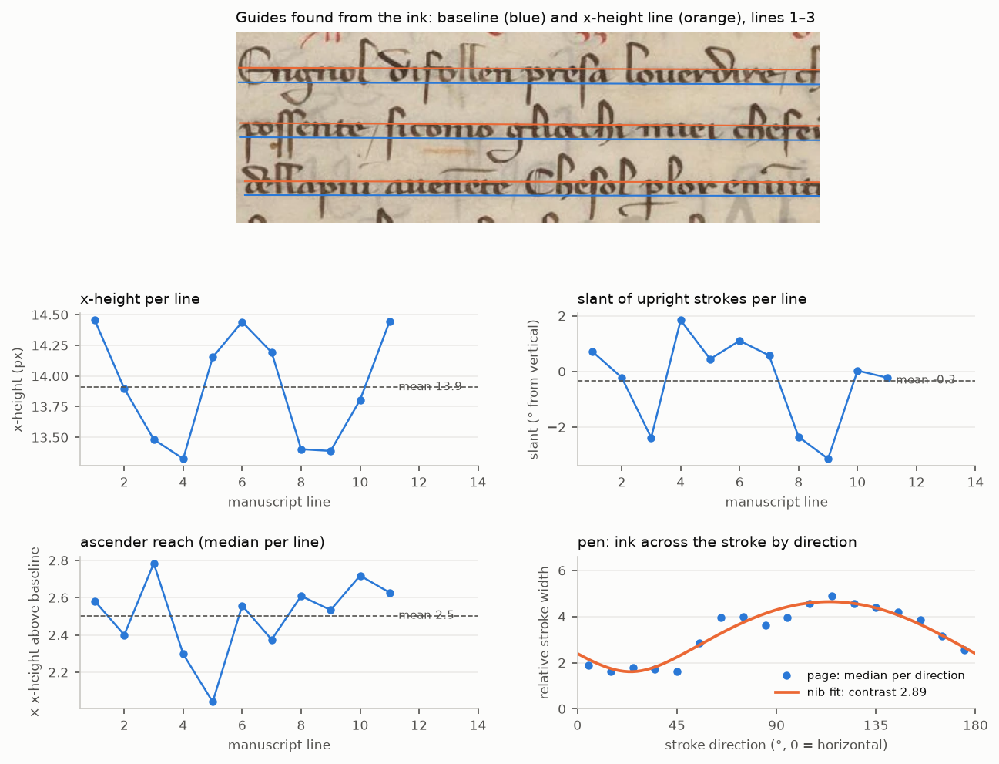

The same `latin_lines.py` is used, with two additions:

- The painted initial is masked out.
- Red ink (rubric and paragraph strokes, a\* ≈ 25 against ≈ 4 for the brown text) is
  separated by colour. Each line is then fitted on its own ink, so the red stroke under
  *disdengnosa* doesn't pull line 9's guides.

The results:

- **Proportions.** x-height 13.9 ± 0.5 px; ascenders reach 2.5 x-heights above the
  baseline; descenders drop 1.6 below; line spacing 55 px (4.0 x-heights). The page
  is laid out more openly than the Lucretius (3.4 x-heights).
- **Upright.** Slant is −0.3° ± 1.6°. As on the Lucretius page, the left and right
  halves of each line don't agree (r ≈ 0 for slant and x-height). Line-to-line
  differences are noise, so size and slant are constant across the page.
- **A real broad-edged pen.** Thick/thin contrast is **2.9**:
  - Strokes travelling up-right at about 25° are hairlines; strokes at about 115° are
    full width.
  - The fit is good (residual 0.30 px).
  - The thin direction gives the pen angle: about 25°, a fairly flat pen angle, as
    usual for the Italian rounded Gothic book hand (northern textura is written
    steeper).

### Traced letters

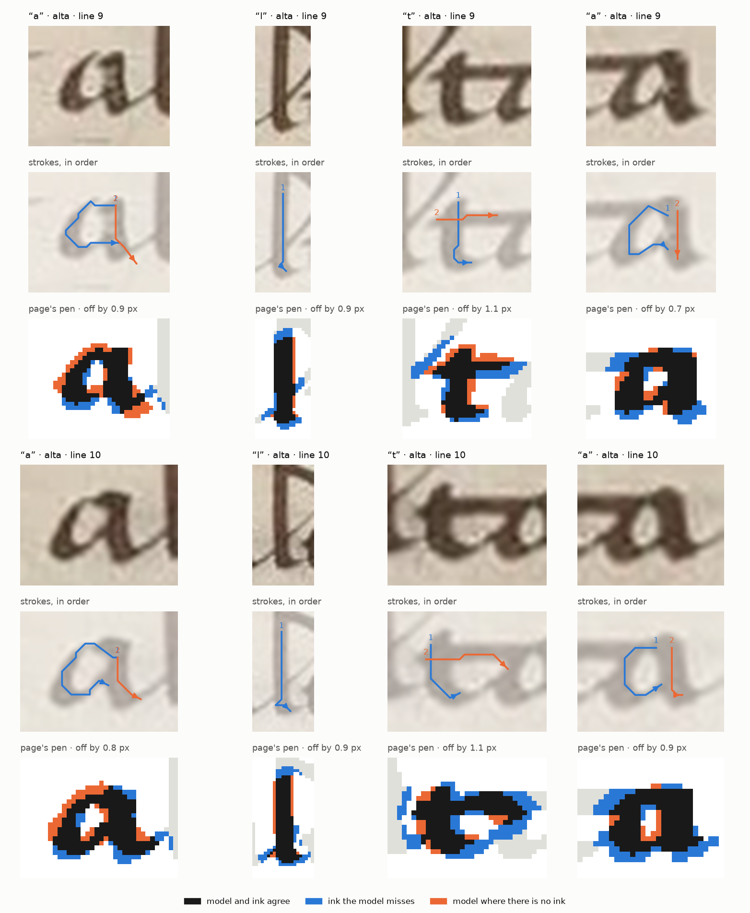

Both occurrences of *alta* (lines 9 and 10) are traced: four a's, two l's and two t's.

- **The pen model fits.** Re-drawn with the page's pen (6.5 × 2.3 px at 24°), every
  outline is within 0.7–1.1 px of the ink.
- **Up and down.** Along the traced strokes, downstrokes are 4.5 px wide and upstrokes
  1.6 px. Here that follows from the nib angle alone; on the Lucretius page it needed
  pressure as well.
- **Context changes letter shape.** In *both* words, the first a is about 1.25
  x-heights wide and the last only about 0.78. The t's cross-stroke runs straight into
  the final a (a *ta* ligature), and that a is compressed. Two words are not
  statistics, but the same pattern twice is what a contextual-variant rule in the
  editor would have to reproduce.

## Fourth sample: French textura (Clermont-Ferrand MS 2262)

**What and where.** A Book of Hours in the Bibliothèque du Patrimoine of Clermont
Auvergne Métropole, Clermont-Ferrand (library code FR-631136102), **MS 2262**. The
digitisation is a 137-image PDF on Wikimedia Commons; this environment couldn't reach
it, so it was supplied as three uploads.

The book has three main parts:

- **A calendar** (ff. 1r–10v, January to December), in red and brown with gold
  initials.
- **The Hours of the Virgin.** Matins opens on f. 11r with *Domine labia mea
  aperies*, the invitatory *Ave Maria gratia plena* and *Venite exultemus*.
- **A litany**, on lines filled with blue, rose and gold line-fillers.

On f. 1r are a later owner's signature ("… Chamaillard"), a crowned monogram,
and the stamp of the former Bibliothèque municipale et interuniversitaire (BMIU)
of Clermont-Ferrand.

**Why Clermont.** The calendar and the litany are those of the diocese of Clermont in
Auvergne:

- **Bishops of Clermont:** Bonitus (Bonnet) on 15 January, with a translation in June;
  Illidius (Allyre), with a December translation; Gallus on 1 July; Austremonius,
  Clermont's first bishop.
- **Relics kept at Clermont:** Agricola and Vitalis, with their translation in
  November.
- **Regional saints:** Gerald of Aurillac (13 October); Robert of La Chaise-Dieu
  (*Robberti*, 24 April, the day after George).
- **The litany** names the same group: *Sancte bonite, … geralde, … robberte*.

The script and the decoration are French, 15th century. The calendar's feast of the
Transfiguration (6 August) suggests the second half of the century, but some French
diocesan calendars had it earlier, so that is only a hint.

**The page studied.** f. 12r, Psalm 8 at Matins (`data/clermont-ms2262-f012r.jpg`,
300 dpi). Its diplomatic reading, with the Vulgate alongside, is in
`data/hours_reading.json`. Writing it out letter by letter caught one trap: at small
size, textura *p* biting into *e* looks like the abbreviation ꝑ, but the scribe writes
*super*, *perfe-* and *per-* in full.

### What the page shows

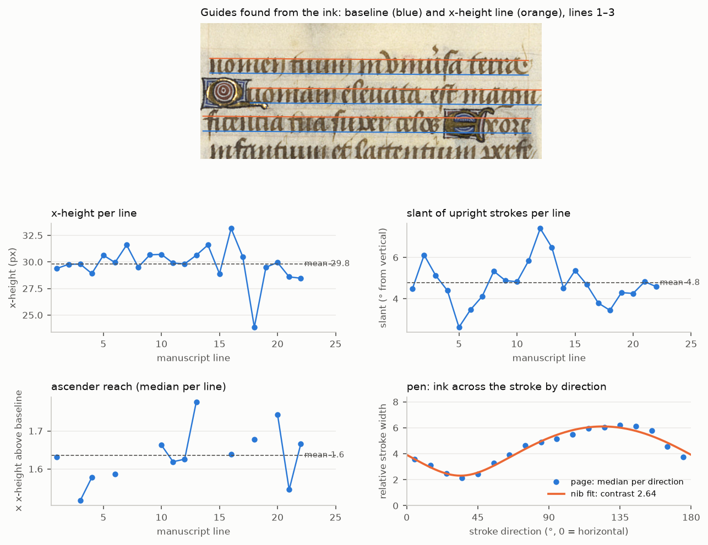

`latin_lines.py` handles this page with two additions:

- **Painted initials and line-fillers are masked by colour.** Blue and rose regions are
  grown to their gold frame and blanked.
- **The page is ruled, so all lines share one slope.** Each line keeps only its own
  height. Without this, a painted initial or a dense run of ascenders tilted the
  guides.

The results:

- **A compact hand.** x-height 29.8 ± 1.7 px (2.5 mm). The lines are only 1.94
  x-heights apart. Ascenders rise 1.64 x-heights above the baseline, and descenders
  drop 0.61.
- **Nearly upright and steady.** Slant is 4.8° ± 1.1°. As with the other two Latin
  scribes, line-to-line differences don't hold up between halves of a line.
- **A broad pen, cleanly fitted.** Contrast is 2.64 and the thinnest direction is 34°:
  a steeper pen than the Italian rotunda's 24°, as expected for a northern textura.
  This is the best single-nib fit of the four hands (relative residual 0.056).

### The letterforms

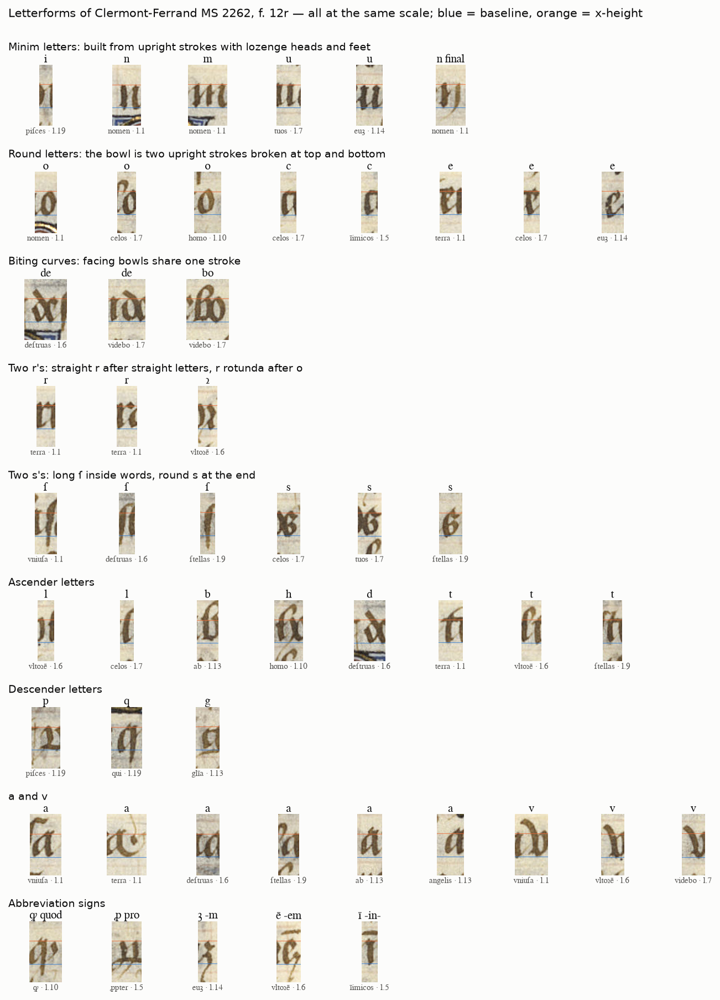

`letterforms.py` cuts letters out of f. 12r at one scale, each in the vertical window
of its own line's guides. The letter positions were read from gridded close-ups and
checked against overlays. They show the rules this hand follows, and the editor will
have to follow them too:

1. **Everything is built from upright strokes.** i, n, m and u are one, two, three and
   two minims, each with a lozenge head and foot. Without dots or context they are
   ambiguous; this is the minim problem every textura reader knows.
2. **Round letters are broken.** o is two upright strokes joined at angles, and c and
   e share the same broken curve; e adds an eye.
3. **Facing bowls fuse ("biting").** *de*, *bo* and *pe* share a stroke where the
   letters meet. The renderer needs these as joined pairs, not as two glyphs with
   kerning.
4. **Two r's.** After *o* the scribe always writes r rotunda (ꝛ): 7 of 7 in this
   transcription (*oꝛe, vltoꝛē, digitoꝛum, tuoꝛum, memoꝛes, honoꝛe, pecoꝛa*). After
   every other letter he writes the straight r (15 of 15).
5. **Two s's.** Long ſ appears at the start and in the middle of words, round s at the
   end (checked closely in *celos* twice, *tuos*, *ſtellas* and *memoꝛes*).
6. **v at the start of a word, u inside it** (*vniuersa, vt, vltore, videbo, visitas*).
7. **Word-final forms.** Final n has a descending tail (*nomen*), and final -m can be
   the z-shaped ꝫ (*euꝫ, tuaruꝫ*). The textura a is two-storey; a line-final a gets a
   flourish (*terra*).
8. **Abbreviations:**
   - a macron for a missing m or n (*glīa, quā, īimicos, Omīa, vltoꝛē*);
   - ꝙ for *quod*, ꝓ for *pro*, qm̄ for *quoniam*;
   - a superscript stroke for *-er-* (*vniu[er]sa*).

### Minim rhythm: what makes it textura

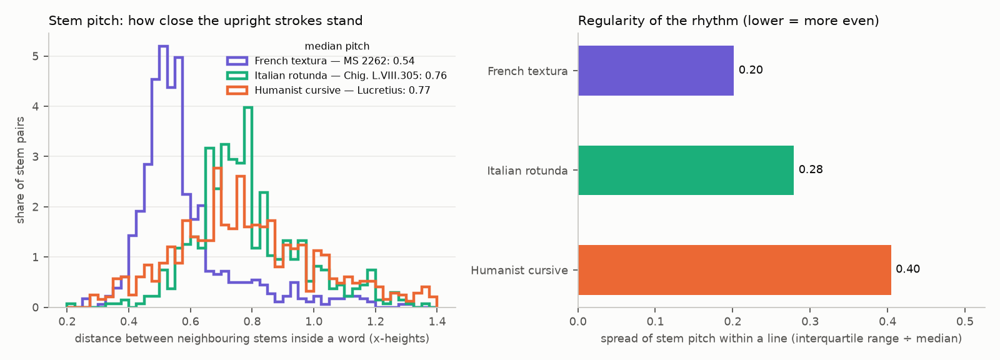

For every text line, the x-band is sheared upright by the line's slant. Columns that
are ink from top to bottom of the band count as stems, and the distance between stems
inside a word is the pitch.

Blur widens strokes and narrows gaps by the same few pixels, so all three scans are
compared at the same 14 px x-height. Pitch, measured centre to centre, doesn't depend
on blur.

| | French textura | Italian rotunda | Humanist cursive |
|---|---|---|---|
| Stem pitch (x-heights) | **0.54** | 0.76 | 0.77 |
| Spread of pitch in a line (IQR ÷ median) | **0.20** | 0.28 | 0.41 |

- **The textura packs its strokes about 40% closer** than the other two hands, and
  spaces them most evenly. That even "picket fence" is the visual signature of
  textura, and it is now a number the renderer can be held to.
- **White and black are about equal.** In the textura, the white between stems equals
  the stem width at 14 px (ratio 0.99); at the scan's full 300 dpi the white is
  slightly wider (1.28).
- **The width ratio isn't compared across hands.** It is too sensitive to resolution,
  and in the rounder hands small closed bowls also count as "stems".

### Traced letters

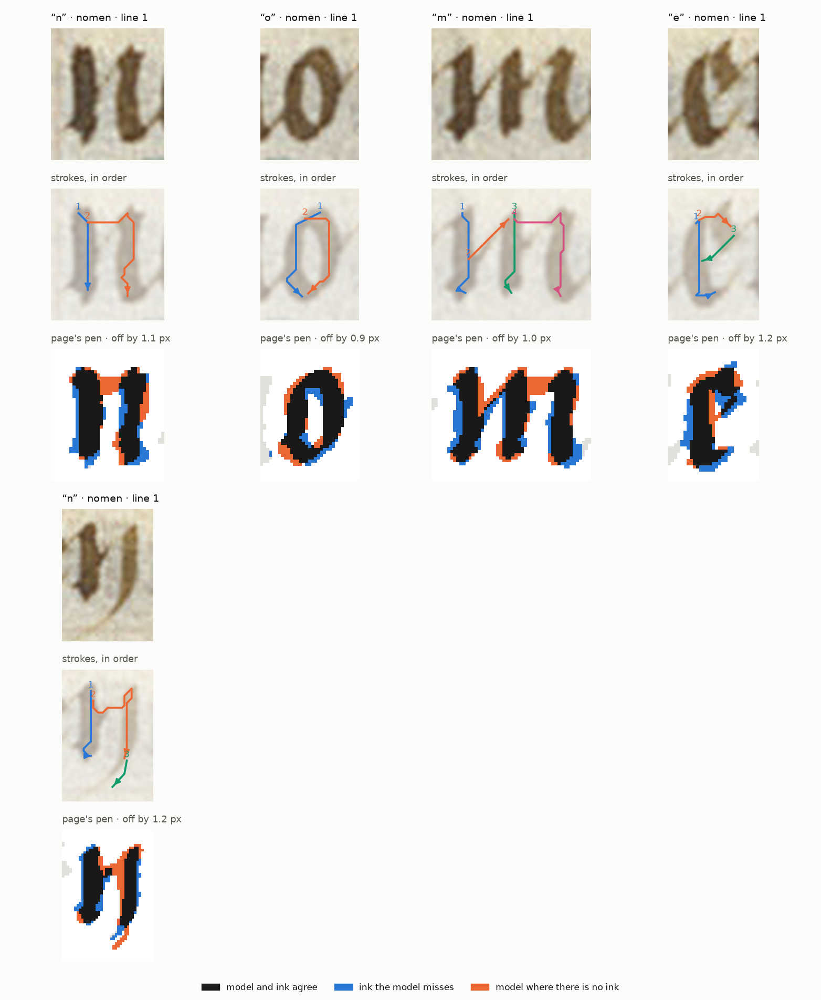

The first word, *nomen* (line 1), is traced in full, in the scribe's stroke order, with
ink-following between the clicks.

- **The pen model fits.** Re-drawn with the page's pen, the letters land within
  0.9–1.2 px of the ink.
- **Up and down differ strongly.** Along the traced strokes, downstrokes are 4.0 px
  wide and upstrokes 1.8 px.
- **The ductus matters, not just the outline.** The textura e is three strokes:
  1. its back (head, stem, foot);
  2. a broad stroke out to the right from the top, its end dropping slightly;
  3. a hairline from the end of that stroke down-left to the stem, closing the eye.

  The scribe's m joins its first two minims with the same kind of hairline, rising
  diagonally from the middle of the first stroke to the head of the second.
- **Hairlines need the pen's corner.** These hairlines, like the tail of the final n,
  are thinner than the nib's own narrow edge. Strokes named *hairline…* or *…tail* are
  now drawn with the corner of the pen (`pen.is_corner_stroke`), at half the narrow
  edge. The tail is too faint to ink-follow, so it is drawn as a smooth curve through
  its clicks.
- **The tracer suggests this e** for the Book of Hours: back, top stroke, hairline.

### Limits

- **One page analysed in depth.** The book's other text pages (about a hundred) are in
  the PDF and can be run the same way. Page-to-page consistency hasn't been measured yet.
- **Letter boxes are approximate.** Positions in the atlas were read by eye (±2 px).
  The transcription hasn't been checked against a printed edition or catalogue.
- **The library's own description of MS 2262 wasn't found** online from here. The
  dating above rests on the calendar and the style alone.

## The four hands compared

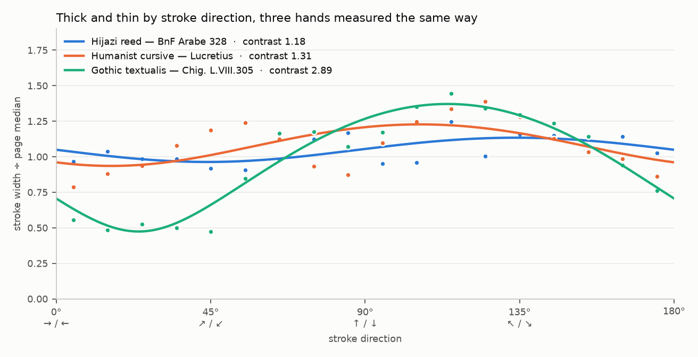

`compare.py` measures the pen on all four pages with the same method (ink across the
stroke, divided by the page's median).

| | Hijazi reed (Arabe 328) | Humanist cursive (Lucretius) | Italian rotunda (Chigi) | French textura (MS 2262) |
|---|---|---|---|---|
| Thick/thin contrast | 1.18 | 1.31 (poor single-nib fit) | **2.89** | **2.64** |
| Thinnest stroke direction | 44° | 16° (unclear) | 24° | 34° |
| Slant of uprights | 25–34°, alif ≈ 9° more than lām | 14.8° | upright (−0.3°) | 4.8° |
| Where variation lives | shared by each word (size r = 0.97) | within lines, not between | within lines, not between | within lines, not between |
| Line spacing | — | 3.4 x-heights | 4.0 x-heights | 1.9 x-heights |
| Ascender above baseline | alif ≈ 7.8 stroke widths | 2.0 x-heights | 2.5 x-heights | 1.6 x-heights |
| Stem pitch (at 14 px x-height) | — | 0.77 x-heights | 0.76 x-heights | **0.54 x-heights** |

What this means for the editor:

- **One renderer can serve all four hands.** A swept nib with three settings (size,
  contrast, angle) produces the near-monoline reed, the light humanist pen and both
  broad Gothic nibs. Hairline tails and joins are drawn with the pen's corner
  (`pen.is_corner_stroke`).
- **Some hands need more than angle.** The cursive needs an extra up-/downstroke
  (pressure) setting, which the traced stroke direction supplies.
- **Each hand varies at a different level.** The Hijazi scribe varies whole words; the
  three Latin scribes hold the page steady and vary within lines. The variation model
  needs a level setting per style.
- **A style is also a set of spacing targets.** Stem pitch and its evenness tell the
  textura apart from the rotunda and the cursive more clearly than any single letter
  shape. Layout should be driven by these numbers, not by fixed glyph widths.
- **Every style needs a text step before drawing.** These all sit between the reading
  and the strokes:
  - contextual letter forms (the Chigi *ta*; the textura's ꝛ after o, ſ inside words
    and s at the end, v at the start of a word, fused *de/bo/pe*);
  - abbreviations (the Lucretius ꝑ and q;, the textura's macrons and ꝙ, ꝓ, ꝫ);
  - early spelling (Hijazi short spellings, Tuscan ç/ngn).

## Sources

- The Arabic page image is from Gallica: Source gallica.bnf.fr / Bibliothèque nationale
  de France, Département des Manuscrits, Arabe 328. Gallica permits free non-commercial
  reuse with this attribution. Check the BnF terms before any commercial use.
- The Chigi page is a detail of Città del Vaticano, Biblioteca Apostolica Vaticana,
  Chig. L.VIII.305, f. 1r (DigiVatLib, with the Library's watermark). Check the BAV's
  terms before any reuse beyond study.
- The Book of Hours is Clermont-Ferrand, Bibliothèque du Patrimoine (Clermont Auvergne
  Métropole), MS 2262, from the digitisation published on Wikimedia Commons
  (`FR-631136102_MS_2262_Book_of_Hours.pdf`). Check the file page's licence before
  reuse.
- The Lucretius page image was supplied with this project. Its holding library and
  reuse terms still need to be recorded here.
