# Viability checks: stroke-and-nib models of four scribes

Four hands are tested:

- an early Hijazi Qur'an (BnF Arabe 328, below),
- a 15th-century Latin humanist cursive
  ([Lucretius](#second-sample-latin-humanist-cursive-lucretius)),
- a 14th-century Italian Gothic book hand
  ([Chig. L.VIII.305](#third-sample-italian-gothic-textualis-chig-lviii305)), and
- a 15th-century French Book of Hours in textura
  ([Clermont-Ferrand MS 2262](#fourth-sample-french-textura-clermont-ferrand-ms-2262)),
  studied letter by letter.

The [comparison](#the-four-hands-compared) at the end puts them side by side.

## Hijazi: one scribe's الله

**Question.** Can a model that *writes* letters, with a pen following stroke paths,
reproduce a real early Qur'anic hand? Can it also vary the way the scribe varied,
instead of repeating one fixed glyph the way a font does?

**Test material.** One page of BnF Arabe 328 (Hijazi script, Sūrat al-Baqarah
2:282–286), the 1024 × 1392 px image from Gallica. Every الله on the page was traced:
9 full instances, plus two لله on line 11. One of those is the second half of a والله
the scribe split across lines 10/11. That gives 11 instances.

**Short answer: viable.** The pen model redraws every instance to within about one scan
pixel. The measurements are reproducible from rough clicks, and the scribe's variation
turns out to be structured, so it can be modelled. Details and limits below.

## How it works

| Step | File | What it does |
|---|---|---|
| Ink | `ink.py` | Separates ink from parchment, water stains and the mirrored show-through from the other side of the leaf. Each pixel is compared with the local parchment brightness. |
| Trace | `data/traces_allah.json`, `../tools/tracer/` | For each word, a rough click at the top and foot of the alif, both lāms, the hā' and the baseline. |
| Measure | `measure.py` | Snaps each rough stroke onto the ink, re-fits it as a straight shaft, finds the baseline and the hā' loop, and outputs 11 features per word. |
| Pen | `nib.py` | Estimates the nib from about 17,000 stroke-width samples across the whole page. |
| Render | `pen.py`, `ductus.py` | Sweeps an elliptical nib along stroke centre-lines and outputs a vector outline (SVG). `ductus.py` is the stroke plan for الله, driven by the measured features. |
| Check | `run.py` | Runs everything and writes figures and numbers to `out/`. |

```sh
pip install -r requirements.txt
python3 run.py          # ~2 minutes; writes out/
```

## Results

### 1. The pen: an almost even-width reed


Stroke width hardly depends on direction. An elliptical nib of **6.6 × 5.6 px held at
47°** fits the page to within 0.19 px, giving a **thick/thin contrast of 1.18**. For
comparison, a broad-edge pen for Naskh or textura is roughly 5–10.

Horizontal strokes come out about 8% heavier than the slanted shafts (6.2 vs 5.7 px).
The reading I gave earlier from the image alone was right. This hand's character lies
in shapes, proportions and spacing, not in thick/thin modulation.

### 2. The model redraws every instance to within about a pixel


Each word was rebuilt from its own 11 measurements and the page-wide nib, then laid
over its ink:

- **Average outline error: 0.57–1.04 px** against a stroke width of 5.5 px.
- **Overlap: 63–80%.** At this stroke width a one-pixel shift on each side already
  costs about a third of the overlap, so the outline distance is the more telling
  number.

The remaining error is at the scan's resolution limit. Ink from neighbouring letters
that touches the word (shown in grey in the figure) is left out of the score, since
separating it is a segmentation problem, not a pen-model question.

### 3. Measurements are stable; the variation is the scribe's

A real repeatability test was run: every click was moved by random noise (SD 2.5 px)
and each word was re-measured 12 times.

| Feature | n | Mean | Scribe's SD | Range | Measurement noise SD |
|---|---:|---:|---:|---:|---:|
| alif height | 7 | 42.6 px (7.8 sw) | 3.1 px | 36.5–46.8 | 1.4 |
| lām¹ height | 10 | 41.7 px (7.6 sw) | 4.4 px | 35.4–51.3 | 1.0 |
| lām² height | 10 | 40.4 px (7.4 sw) | 5.0 px | 28.9–47.9 | 2.2 |
| alif slant | 7 | 34.4° | 2.5° | 30.8–37.9° | 0.3 |
| lām¹ slant | 10 | 25.3° | 2.0° | 21.5–28.2° | 0.1 |
| lām² slant | 10 | 24.9° | 3.5° | 19.4–30.2° | 0.5 |
| alif → lām¹ gap | 7 | 23.3 px (4.3 sw) | 1.8 px | 20.6–26.1 | 0.2 |
| lām¹ → lām² spacing | 10 | 18.9 px (3.4 sw) | 2.6 px | 14.0–23.1 | 0.2 |
| lām² → end of hā' | 9 | 24.4 px (4.5 sw) | 2.7 px | 22.2–30.5 | 0.6 |
| hā' height | 9 | 12.1 px (2.2 sw) | 1.2 px | 9.5–13.5 | 0.7 |
| hā' width | 9 | 17.6 px (3.2 sw) | 1.9 px | 16.0–22.0 | 0.5 |

*sw* = stroke widths (5.5 px), the scale-free unit. Slants are measured from vertical,
top leaning right.

- **Measurement noise is small next to the variation.** Slants and spacings are 5–40×
  smaller than the scribe's spread. Heights are the weakest case at 2–4× smaller,
  because the top of a stroke is where a click matters most.
- **A rule a font would not know.** In every one of the 7 words with a free alif, the
  alif leans further than both lāms, by 9° on average (34° vs 25°).
- **Moderate variation.** The scribe's variation is 7–14% of each size and 2–3.5° of
  slant.

### 4. The variation is shared across the word

Each letter was predicted only from the *other* letters of the same word
(leave-one-out), so no letter can explain itself:

- **Size is shared by the whole word.** The alif's height correlates with the average
  lām height of the same word at r = 0.97 (n = 7). Each lām's height correlates with
  the rest of its word at r ≈ 0.63 (n = 10). The whole word's size varies with an SD of
  about 9.5%.
- **Slant is partly shared.** Correlations are 0.38–0.72, and the word's slant varies
  with an SD of 2.3°.

This is the structured variation the earlier discussion predicted. A big part of the
"handmade" look is that a whole word comes out a little larger, or leans a little more,
not that each letter wobbles on its own.

### 5. Generating new instances


- **Top row: the originals.**
- **Middle row: generated words.** Each is sampled from the measured averages, plus a
  shared size and slant per word, plus small per-letter residuals, and drawn with the
  page's nib.
- **Bottom row: the naive alternative.** The same average shape with independent
  random jitter on every point, at the same amount of positional spread (3.3 px). It
  produces kinked shafts no reed would draw.

The middle row stays inside the scribe's range and keeps the straight, confident
shafts. Vector versions are in `out/allah_mean.svg` and `out/allah_variants.svg`.

## Limits of this check

- **Resolution.** At 1024 px a stroke is about 5.5 px wide, so nib shape, stroke ends
  (the reed's cut) and ink pooling can't be measured. The model draws round ends; the
  originals look blunter. The full-resolution Gallica scan (blocked from this
  environment) would fix this. The pipeline doesn't depend on the scale.
- **Sample size.** 7–10 values per feature are enough to show structure, but not to
  pin down correlations precisely. Two hints in the data need more pages before they
  count as findings:
  - The line-end word (K) is the smallest.
  - The word continuing a line-split (F) has the tallest first lām.
- **One word, one template.** The stroke plan for الله was written by hand. The hā'
  loop is a generic teardrop, and the alif-to-lām joins are simplified. Other letters
  need their own plans, and a single connector model is needed for joining.
- **Ink texture is not modelled.** Ink-cycle fading and edge roughness are not part of
  the model. They are a separate rendering layer and were deliberately left out here.

## Exclusions (from the flags in `data/traces_allah.json`)

- **H (line 13):** its lām² and alif run into the line above, so heights can't be
  separated at this resolution. It is shown in the fit figure but left out of all
  statistics.
- **J (بالله):** the alif is joined to the preceding bā', which is a different letter
  form. It is left out of the alif statistics.
- **G (لله ما):** the hā' touches the next letter. It is left out of the hā'
  statistics.
- **F, G:** these have no alif of their own.

## Next steps this supports

1. **More data.** Trace the remaining folios of Arabe 328 with `tools/tracer` to get
   n ≈ 50–100 per letter, ideally at full resolution.
2. **Joining.** Add stroke plans for the other letter forms and one connector model,
   then render a whole line from Unicode text.
3. **Line context.** Add the line-level layer: spacing between connected letter groups,
   stretched joins and line breaks. Then test whether position in the line explains
   the leftover variation.

## Second sample: Latin humanist cursive (Lucretius)

**Test material.** The opening page of a 15th-century humanist manuscript of Lucretius,
*De rerum natura* I.1–25 (`data/lucretius-drn-1r.jpg`, 1443 × 2000 px). It has a title
in epigraphic capitals with Greek, 24 lines of text, and an "Amerbachiorum" ex-libris
at the foot.

`data/lucretius_reading.json` holds the reading from the printed edition, split at the
manuscript's own line breaks:

- The manuscript **omits** the line *Illecebrisque tuis omnis natura animantum* (I.15),
  so its line 14 runs straight on to *Te sequitur cupide…*.
- The scribe abbreviates heavily (p with a stroke for *per/pre*, *q;* for *-que*, a
  macron for *m/n*) and writes *u* for *v* and *e* for *ae*. So the reading shows what
  the text *says*, and a separate "diplomatic" field records what the scribe *wrote*.
  That field is filled in only where it was checked against the image (line 24 and
  the title lines). The rest is left for tracing.

| Step | File | What it does |
|---|---|---|
| Lines | `latin_lines.py` | Finds every line's baseline and x-height line from the ink, plus ascender and descender reach, slant and pen; writes `data/lucretius_lines.json`. |
| Trace | `../tools/tracer/` (Lucretius sample) | Pick a letter in the reading, then click each stroke in writing order; the path between clicks follows the ink (`inkpath.py`). |
| Letters | `measure_letters.py` | Measures traced letters in x-heights, re-draws them with the page's pen, and compares the result with the ink. |

```sh
python3 latin_lines.py       # guides + line figures
python3 measure_letters.py   # traced letters (data/traces_lucretius.json)
```

### What the page shows


- **Guides found automatically.** All 24 text lines and 4 of the 5 title lines were
  found. The fifth, the one-word Greek ΦΥϹΕΩϹ, is too short to register.
- **Proportions:**
  - x-height: 13.7 ± 0.5 px.
  - Line spacing: 46 px (3.4 x-heights).
  - Ascenders: about 2.0 x-heights above the baseline.
  - Descenders: about 1.5 x-heights below.
  - Upright strokes: 14.8° from vertical.
  - Lines: level (−0.1° ± 0.2°).
- **No line-to-line drift.** Each line's left half was measured separately from its
  right half:
  - Slant: the halves agree only weakly (r = 0.31).
  - x-height: they don't agree at all (r = −0.07).

  So the differences between lines are mostly noise. This scribe keeps size and slant
  steady across the page, and the visible variation lives *within* lines. That is the
  opposite of the Hijazi page, where variation was shared by whole words.
- **Pen.** Strokes are only about 4 px wide here, too coarse to count pixels, so width
  is measured as the amount of ink across each stroke. The same method on the Hijazi
  page gives 1.18 at 44°, agreeing with the pixel method above.
  - Thick/thin contrast is only about 1.3, and no single nib angle fits well.
  - There are two thin directions: horizontal, and close to the upright slant.
  - The likely reason is that in a cursive hand the upstrokes are written lighter than
    the downstrokes at the same angle. A direction-only measurement can't separate the
    two, but traced strokes can, because they record which way the pen moved.

### Traced letters


Three letters of *rerum* (line 24) are traced as seeds: both r's and the m. Re-drawn
with the page's pen, their outlines are 0.9–1.5 px from the ink.

Along these strokes, downstrokes come out heavier than upstrokes (4.2 vs 3.6 px), as
the pen analysis predicts. With 31 samples from three letters this is a hint, not a
result. The e and u of the same word are left untraced: a descender from line 23
crosses them, and their ductus can't be read with confidence at this resolution.

### What this means

- The tracing and measuring pipeline carries over from Arabic to Latin unchanged in
  structure. Line guides replace the per-word baseline, and strokes become polylines in
  writing order.
- For a cursive Latin hand the pen model needs a **pressure channel**. It must know
  whether a stroke is an upstroke or a downstroke, not only its angle. The tracer
  already records this.
- Size and slant can be held constant per line for this scribe. The variation model
  belongs at word and letter level.
- The editor's text layer needs an **abbreviation step** between the reading and the
  letters to be drawn (*per* → ꝑ, *-que* → q;, *-um* → ū). Otherwise a rendered line
  will spell out what the scribe abbreviated.
- Next step: trace a few lines in full, ideally on a full-resolution scan, to get
  10–20 instances per common letter. Then build the first stroke plans for this
  alphabet from them.

## Third sample: Italian Gothic textualis (Chig. L.VIII.305)

**What and where.** The page is **Città del Vaticano, Biblioteca Apostolica Vaticana,
Chig. L.VIII.305, f. 1r**, the opening page of the *Chigi canzoniere*. It is a
Florentine/Tuscan anthology of the *stilnovo* poets, usually dated to the middle of the
14th century. The image is a detail cropped at the right (`data/chigi-L-VIII-305-f1r.webp`).

The identification rests on five pieces of evidence:

1. **Library.** The diagonal watermark "…Apostolica Vaticana" is the one the Vatican
   Library puts on its digital images.
2. **Text.** It is Guido Guinizzelli's canzone *Tegno de folle 'mpresa, a lo ver
   dire*, stanzas 1–2 and the start of 3. It matches Contini's edition line for line
   (`data/chigi_reading.json`). Dante cites this canzone in *De vulgari eloquentia*.
3. **Rubric.** The red rubric reads *Mess[er] Guido guinizelli da bolong[na]*. Naming
   the poet's city marks a compilation made *outside* Bologna.
4. **Which Vatican manuscript.** Both Vatican songbooks that carry this canzone were
   considered:
   - **Vat. lat. 3793**, the other great early canzoniere, is written in mercantesca
     and chancery hands with plain black initials, so it is excluded.
   - **The Chigi codex** opens its Guinizzelli section on f. 1r with a large
     decorated T of *Tegno de folle*, described in the Vatican's catalogue notes as
     blue and red with red and violet filigree. That is exactly the initial on this
     page.
5. **Script and spelling.** The script is an Italian Gothic textualis: upright, with
   rounded bowls, the uncial *d*, and the long *ſ* standing on the line. The spelling
   is Tuscan scribal: *ç* for *z* (*força*), *ngn* for the palatal *n* (*disdengnosa*,
   *bolongna*), and the Latinizing *inlecto*.

**Readings worth noting** (from this image, before checking a facsimile):

- Line 5 reads *quando uuol **far** usar força*, where the edition has *quando vuol usar
  forza*.
- Line 10 keeps Guinizzelli's Bolognese *plu* (*chelaplu bella*), as the edition does.
- The verses run on like prose, separated by a slash-like virgula.
- The stanza ends with *:* (line 9), and the next stanza opens with a larger,
  red-touched B.

### What the page shows


The same `latin_lines.py` is used, with two additions:

- The painted initial is masked out.
- Red ink (rubric and paragraph strokes, a\* ≈ 25 against ≈ 4 for the brown text) is
  separated by colour. Each line is then fitted on its own ink, so the red stroke under
  *disdengnosa* doesn't pull line 9's guides.

The results:

- **Proportions.** x-height 13.9 ± 0.5 px; ascenders reach 2.5 x-heights above the
  baseline; descenders drop 1.6 below; line spacing 55 px (4.0 x-heights). The page
  is laid out more openly than the Lucretius (3.4 x-heights).
- **Upright.** Slant is −0.3° ± 1.6°. As on the Lucretius page, the left and right
  halves of each line don't agree (r ≈ 0 for slant and x-height). Line-to-line
  differences are noise, so size and slant are constant across the page.
- **A real broad-edged pen.** Thick/thin contrast is **2.9**:
  - Strokes travelling up-right at about 25° are hairlines; strokes at about 115° are
    full width.
  - The fit is good (residual 0.30 px).
  - The thin direction gives the pen angle: about 25°, a fairly flat pen angle, as
    usual for the Italian rounded Gothic book hand (northern textura is written
    steeper).

### Traced letters


Both occurrences of *alta* (lines 9 and 10) are traced: four a's, two l's and two t's.

- **The pen model fits.** Re-drawn with the page's pen (6.5 × 2.3 px at 24°), every
  outline is within 0.7–1.1 px of the ink.
- **Up and down.** Along the traced strokes, downstrokes are 4.5 px wide and upstrokes
  1.6 px. Here that follows from the nib angle alone; on the Lucretius page it needed
  pressure as well.
- **Context changes letter shape.** In *both* words, the first a is about 1.25
  x-heights wide and the last only about 0.78. The t's cross-stroke runs straight into
  the final a (a *ta* ligature), and that a is compressed. Two words are not
  statistics, but the same pattern twice is what a contextual-variant rule in the
  editor would have to reproduce.

## Fourth sample: French textura (Clermont-Ferrand MS 2262)

**What and where.** A Book of Hours in the Bibliothèque du Patrimoine of Clermont
Auvergne Métropole, Clermont-Ferrand (library code FR-631136102), **MS 2262**. The
digitisation is a 137-image PDF on Wikimedia Commons; this environment couldn't reach
it, so it was supplied as three uploads.

The book has three main parts:

- **A calendar** (ff. 1r–10v, January to December), in red and brown with gold
  initials.
- **The Hours of the Virgin.** Matins opens on f. 11r with *Domine labia mea
  aperies*, the invitatory *Ave Maria gratia plena* and *Venite exultemus*.
- **A litany**, on lines filled with blue, rose and gold line-fillers.

On f. 1r are a later owner's signature ("… Chamaillard"), a crowned monogram,
and the stamp of the former Bibliothèque municipale et interuniversitaire (BMIU)
of Clermont-Ferrand.

**Why Clermont.** The calendar and the litany are those of the diocese of Clermont in
Auvergne:

- **Bishops of Clermont:** Bonitus (Bonnet) on 15 January, with a translation in June;
  Illidius (Allyre), with a December translation; Gallus on 1 July; Austremonius,
  Clermont's first bishop.
- **Relics kept at Clermont:** Agricola and Vitalis, with their translation in
  November.
- **Regional saints:** Gerald of Aurillac (13 October); Robert of La Chaise-Dieu
  (*Robberti*, 24 April, the day after George).
- **The litany** names the same group: *Sancte bonite, … geralde, … robberte*.

The script and the decoration are French, 15th century. The calendar's feast of the
Transfiguration (6 August) suggests the second half of the century, but some French
diocesan calendars had it earlier, so that is only a hint.

**The page studied.** f. 12r, Psalm 8 at Matins (`data/clermont-ms2262-f012r.jpg`,
300 dpi). Its diplomatic reading, with the Vulgate alongside, is in
`data/hours_reading.json`. Writing it out letter by letter caught one trap: at small
size, textura *p* biting into *e* looks like the abbreviation ꝑ, but the scribe writes
*super*, *perfe-* and *per-* in full.

### What the page shows


`latin_lines.py` handles this page with two additions:

- **Painted initials and line-fillers are masked by colour.** Blue and rose regions are
  grown to their gold frame and blanked.
- **The page is ruled, so all lines share one slope.** Each line keeps only its own
  height. Without this, a painted initial or a dense run of ascenders tilted the
  guides.

The results:

- **A compact hand.** x-height 29.8 ± 1.7 px (2.5 mm). The lines are only 1.94
  x-heights apart. Ascenders rise 1.64 x-heights above the baseline, and descenders
  drop 0.61.
- **Nearly upright and steady.** Slant is 4.8° ± 1.1°. As with the other two Latin
  scribes, line-to-line differences don't hold up between halves of a line.
- **A broad pen, cleanly fitted.** Contrast is 2.64 and the thinnest direction is 34°:
  a steeper pen than the Italian rotunda's 24°, as expected for a northern textura.
  This is the best single-nib fit of the four hands (relative residual 0.056).

### The letterforms


`letterforms.py` cuts letters out of f. 12r at one scale, each in the vertical window
of its own line's guides. The letter positions were read from gridded close-ups and
checked against overlays. They show the rules this hand follows, and the editor will
have to follow them too:

1. **Everything is built from upright strokes.** i, n, m and u are one, two, three and
   two minims, each with a lozenge head and foot. This scribe puts no stroke over i, so
   without context they are ambiguous; this is the minim problem every textura reader
   knows.
2. **Round letters are broken.** o is two upright strokes joined at angles, and c and
   e share the same broken curve; e adds an eye.
3. **Facing bowls fuse ("biting").** *de*, *bo* and *pe* share a stroke where the
   letters meet. The renderer needs these as joined pairs, not as two glyphs with
   kerning.
4. **Two r's.** After *o* the scribe always writes r rotunda (ꝛ): 7 of 7 in this
   transcription (*oꝛe, vltoꝛē, digitoꝛum, tuoꝛum, memoꝛes, honoꝛe, pecoꝛa*). After
   every other letter he writes the straight r (15 of 15).
5. **Two s's.** Long ſ appears at the start and in the middle of words, round s at the
   end (checked closely in *celos* twice, *tuos*, *ſtellas* and *memoꝛes*).
6. **v at the start of a word, u inside it** (*vniuersa, vt, vltore, videbo, visitas*).
7. **Word-final forms.** Final n and final m have a descending tail (*nomen, tuum,
   manuum*), and final -m can also be the z-shaped ꝫ (*euꝫ, tuaruꝫ*). The textura a is two-storey; a line-final a gets a
   flourish (*terra*).
8. **Abbreviations:**
   - a macron for a missing m or n (*glīa, quā, īimicos, Omīa, vltoꝛē*);
   - ꝙ for *quod*, ꝓ for *pro*, qm̄ for *quoniam*;
   - a superscript stroke for *-er-* (*vniu[er]sa*).

### Minim rhythm: what makes it textura


For every text line, the x-band is sheared upright by the line's slant. Columns that
are ink from top to bottom of the band count as stems, and the distance between stems
inside a word is the pitch.

Blur widens strokes and narrows gaps by the same few pixels, so all three scans are
compared at the same 14 px x-height. Pitch, measured centre to centre, doesn't depend
on blur.

| | French textura | Italian rotunda | Humanist cursive |
|---|---|---|---|
| Stem pitch (x-heights) | **0.54** | 0.76 | 0.77 |
| Spread of pitch in a line (IQR ÷ median) | **0.20** | 0.28 | 0.41 |

- **The textura packs its strokes about 40% closer** than the other two hands, and
  spaces them most evenly. That even "picket fence" is the visual signature of
  textura, and it is now a number the renderer can be held to.
- **White and black are about equal.** In the textura, the white between stems equals
  the stem width at 14 px (ratio 0.99); at the scan's full 300 dpi the white is
  slightly wider (1.28).
- **The width ratio isn't compared across hands.** It is too sensitive to resolution,
  and in the rounder hands small closed bowls also count as "stems".

### Traced letters


The first word, *nomen* (line 1), is traced in full, in the scribe's stroke order. o and
e were clicked on the ink, with ink-following between the clicks; n and m are drawn by
the minim module (next section).

- **The pen model fits.** Re-drawn with the page's pen (the squared nib of the next
  sections), the letters land within 0.8–1.2 px of the ink.
- **Up and down differ strongly.** Along the traced strokes, downstrokes are 4.1 px
  wide; the upward hairlines that join the minims carry 0.8 px of ink.
- **The ductus matters, not just the outline.** The textura e is three strokes:
  1. its back (head, stem, foot);
  2. a broad stroke out to the right from the top, its end dropping slightly;
  3. a hairline from the end of that stroke down-left to the stem, closing the eye.

  The minims of n, m and u are joined by hairlines of the same kind (next section).
- **Separate hairlines use the pen's corner.** The e's closing hairline and the m's
  join are thinner than the nib's own narrow edge. Strokes named *hairline…* are drawn
  with the corner of the pen (`pen.is_corner_stroke`), at half the narrow edge.
- **Word-final tails are twist-and-pull, not a switch to the corner.** The last stroke
  of a word-final n or m comes down the stem at full width, then curves away
  down-left. The scribe keeps pulling and twists the pen, and the width falls away
  smoothly into a long hairline.

  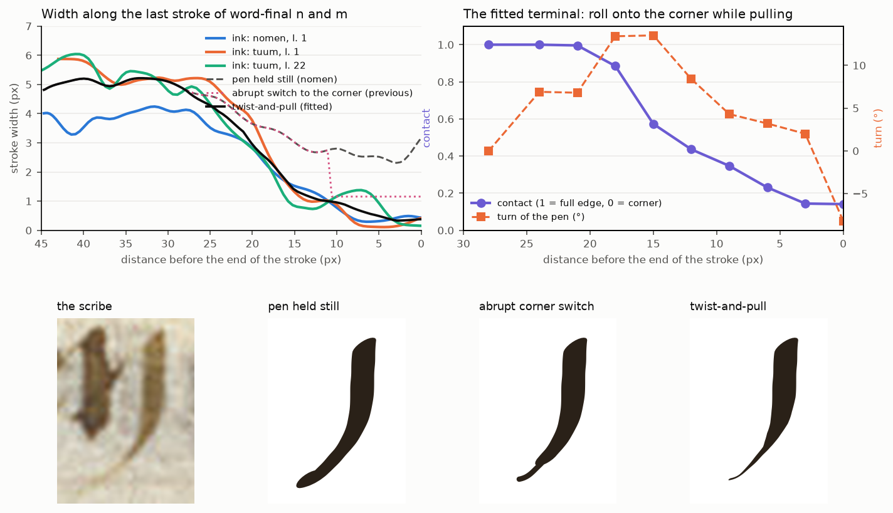

  `twist.py` measures this along three tails (*nomen* line 1, *tuum* lines 1 and 22),
  on a centre-line pulled onto the ink.
  - **Shape of the taper.** Width holds at stem width until about 25 px before the end
    of the stroke. It then falls steadily to about 1 px at 10 px from the end, and to
    0.3 px at the tip.
  - **A fixed pen can't do it.** Turning down-left, a pen held still bottoms out at
    the nib's narrow edge, about 2.4 px.
  - **How the scribe does it.** Solving point by point for the pen's motion gives a
    consistent answer: the pen turns only a little (up to about 13°). Almost all of the
    thinning comes from rolling the pen onto its corner while pulling: contact falls
    from the full edge to about 0.15 of it over the last 18 px.

  The renderer can now twist and roll the pen within a stroke (`pen.twist_profile`).
  The fitted terminal is stored as keyframes by distance from the end of the stroke,
  so it applies to any word-final stroke. The final n of *nomen* ends in it: its last
  minim comes down the stem and twists into the tail. Its outline score (1.0 px) counts
  the faint end of the tail as excess model ink, because that hairline falls below the
  ink-mask threshold; the width profile is the better check, and it matches.
- **The tracer suggests these stroke plans** for the Book of Hours: e as back, top
  stroke and hairline; i, n, m and u as minims with hairline joins.

### i, n, m and u: minims and hairlines

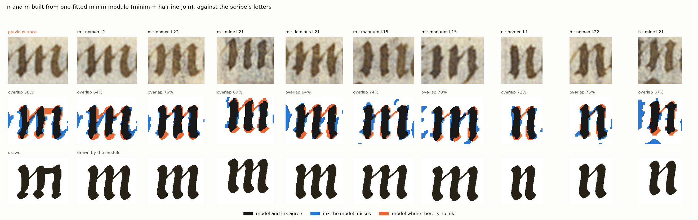

The hand-traced m had an arch from its second minim to its third, drawn as a flat bar
with a spike where it met the stem. The scribe draws no arch. In all six m's on the
page, each minim is a separate stroke with its own lozenge head and foot, and the
minims are linked by thin diagonal hairlines. `minims.py` stops tracing these letters
one by one and rebuilds them from measurements:

1. **One minim for all.** A single minim stroke is fitted to six m's and three n's at
   once, by drawing them with the page's pen and comparing with the ink. Its
   parameters are where the head stroke starts and where the foot ends, in x-heights,
   and the pen's width.
   - Each letter is first shifted onto its ink (up to ±2 px across, ±8 px up or down).
     The letters of *mine* on line 21 sit 4–6 px above that line's fitted baseline.
   - Mean overlap with the ink rises from 64% to 70% (with the squared nib below).
   - For the m of *nomen*, the module scores 65% overlap and 1.4 px outline distance.
     The hand trace scored 61% and 1.5 px.
2. **The hairlines, measured on the darkness image.** They are too faint for the ink
   mask. Across 52 gaps between neighbouring minims, in fifteen runs of minim letters,
   `minims.py` finds the straight line with the darkest ink outside the drawn minims.
   It counts that line as a hairline when it is clearly darker (by 10 levels) than the
   gap around it.

   | Gap | Head join | Foot join | No clear hairline |
   |---|---|---|---|
   | Inside n and m | 8 | 0 | 18 |
   | Inside u | 0 | 5 | 4 |
   | Into a u, from the letter before | 0 | 3 | 4 |
   | Between other letters | 2 | 0 | 8 |

   - **Head join (n, m).** It leaves the right side of a minim at about half the
     x-height (0.52 ± 0.13) and runs up into the head of the next.
   - **Often only the start shows.** In two thirds of the gaps inside n and m no
     hairline stands out. In the m of *nomen*, the join from the second minim to the
     third is only a short spur at mid-height. The module always draws the join
     inside a letter, because it is the path the pen takes to the next head.
   - **Whether the hairline fades can't be measured here.** An earlier version
     reported that it thins towards the next head (to 0.68 of its ink). Re-measured
     with a different nib, the same estimate came out at 1.00. Sampling at fixed points
     across the gap is swamped by the next head's ink. So the joins are drawn at the
     corner's constant width.
   - **Foot join (u).** It leaves the foot of a minim (−0.03 x-height) and rises to the
     middle of the next (0.56 ± 0.06). The same join leads into a u from the letter
     before in 3 of 7 cases.
   - **Between other letters the pen is usually lifted.** 8 of 10 such gaps show no
     hairline.
   - **The rhythm doesn't break between letters.** Stem pitch is 0.53 x-height inside
     letters (±0.04, 35 gaps) and 0.54 between them (±0.04, 17 gaps). Only the joins
     show where one letter ends.
   - **No stroke over i.** None of the five i's checked (*in*, *vniu* twice, *mine*,
     *dominus*) has a stroke or dot above it.
3. **Word-final tails.** A final n or m ends in the twist-and-pull tail above. The
   module uses the mean of the three tails `twist.py` measured.

The n, m and final n of *nomen* in `data/traces_hours.json` are now drawn by the
module.

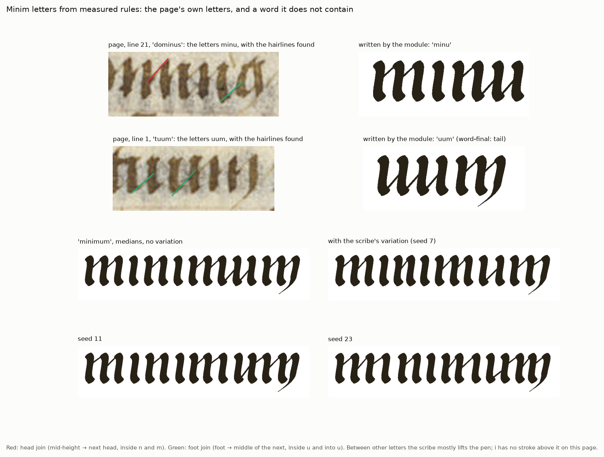

**A word the page doesn't contain: *minimum*.** Fifteen minims in a row is the classic
test of a textura hand. Here it is written from the rules alone:

- once with the medians;
- three times with the scribe's own variation, drawn from the measurements (stem
  pitch, join heights, and whether letters are linked).

Above it, two runs from the page with the hairlines found are shown next to the same
letters written by the module.

### The pen's corners

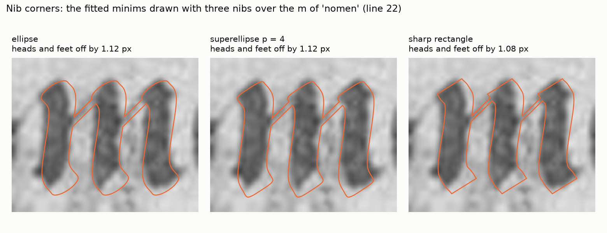

An elliptical nib rounds off the lozenge heads and feet of textura. A broad-edge quill
has a straight edge and corners. `corners.py` models the nib as a superellipse. Its
corner exponent p runs from 2 (an ellipse) to infinity (a sharp rectangle). Each p is
tested two ways:

1. **Width by direction.** The page's per-direction stroke widths are refitted for each
   p.
2. **Letter outlines.** The minim module is refitted with each nib, and its n's and m's
   are compared with the ink.

| Corner exponent p | 2 (ellipse) | 3 | 4 | 6 | ∞ (sharp) |
|---|---|---|---|---|---|
| Width by direction, rms (px) | **0.25** | 0.27 | 0.29 | 0.32 | 0.37 |
| Minims: overlap | 68.9% | 69.4% | 69.9% | 69.8% | **70.0%** |
| Minims: outline distance (px) | 1.16 | 1.15 | 1.14 | 1.14 | **1.13** |
| Heads and feet only (px) | 1.12 | 1.12 | 1.12 | 1.11 | **1.08** |

- **The two kinds of evidence pull opposite ways.** The letters fit better as the
  corners get sharper. The page's width-by-direction curve fits worse.
- **The differences are small.** At 29 px to the x-height a corner is about one pixel
  of blur.
- **p = 4 is used for this hand.** It is a straight edge with slightly softened
  corners. It gains most of the letters' improvement in overlap and outline, and gives
  up little on the width curve. Only the heads and feet, taken alone, improve further
  with a fully sharp edge. The choice is one setting (`nib_p` in
  `measure_letters.PAGES`).

### Finding every letter

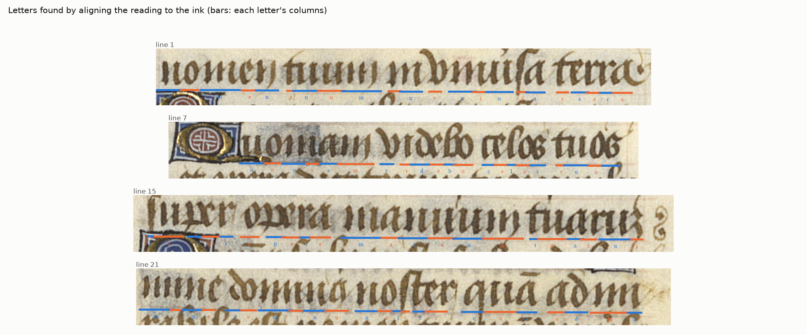

`align.py` places every letter of the reading on f. 12r, 527 in all. It works one
line at a time:

- **Straighten the line.** The line is unslanted, so stems stand upright.
- **Lay templates along it.** Dynamic programming lays the line's letters along it as
  templates, choosing the layout that disagrees with the ink in the fewest pixels.
- **Templates.** i, n, m and u are drawn by the minim module. Every other letter
  starts from its atlas box. After each round, a letter's templates are replaced by the
  examples that agree best with all its other examples.
- **Stem counts.** Minim letters must hold exactly 1, 2, 3 or 2 stems. Templates alone
  slide by one stem, the classic minim confusion.
- **Check.** All 32 minim letters of the minim runs land exactly on their stems.

Building the finder turned up three corrections:
- **Two atlas boxes were wrong.** The s of *ſtellas* and the c of *īimicos* took in
  part of a neighbour. Both are corrected.
- **One reading was wrong.** On line 21, after *do*, *dominus* has exactly eight
  upright strokes. The final s is fused to the u as its flag, an *-us* ligature. The
  reading now has `dominu[s]`.

### The letters of *significatis*

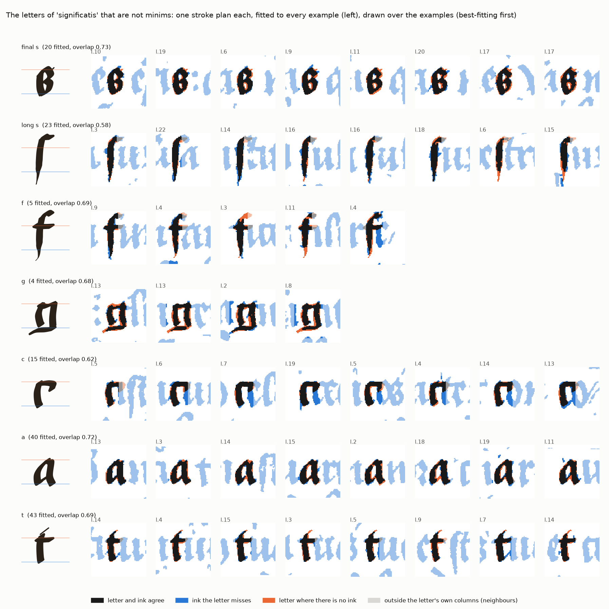

`textura.py` gives each non-minim letter a stroke plan. Each plan is a few strokes in
writing order, each a handful of control points in x-heights, drawn from gridded
close-ups of the sharpest examples.

- **One fit per letter.** Every control point is fitted to all the examples the finder
  located.
- **Comparison.** Each example is compared only within the letter's own columns and
  height zone, after shifting it onto its ink.
- **Limits on movement.** A point may move at most 0.2 x-height from the plan.
- **Other forms.** Examples that fit far worse than the rest are set aside and listed.
- **Variation.** Each example's own width and height scale gives the scribe's
  variation.

| Letter | Strokes | Examples | Overlap | Width varies | Height varies | Set aside |
|---|---|---|---|---|---|---|
| final s | back, roof and spine, belly, hairline flag | 20 | 0.73 | ±11% | ±4% | 2 |
| ſ | stem (pulled to a point), head | 23 | 0.58 | ±10% | ±4% | 1 |
| f | stem, head, crossbar | 5 | 0.69 | ±10% | ±3% | 0 |
| g | left side, top, right side, tail | 4 | 0.68 | ±5% | ±2% | 0 |
| c | back, top | 15 | 0.63 | ±7% | ±5% | 0 |
| a | stem, bowl | 40 | 0.72 | ±6% | ±5% | 0 |
| t | stem, hairline, crossbar | 43 | 0.69 | ±9% | ±4% | 2 |

- **ſ fits least well.** Its head hangs over the next letter, outside the columns it is
  compared in.
- **c's boxes are slightly too wide.** They take in the stem of the next letter.
- **f and g rest on 5 and 4 examples.** The book's other pages would give hundreds.

### The final s

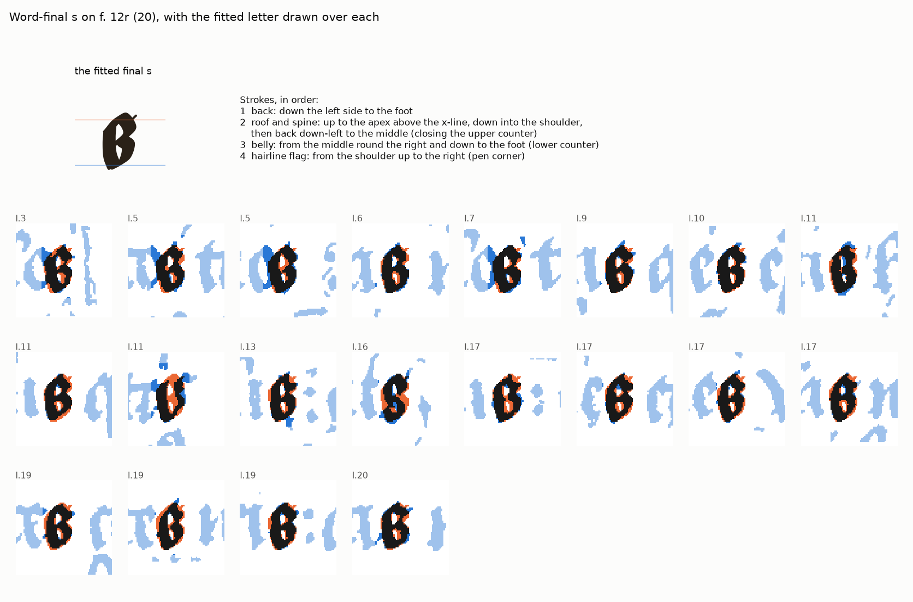

The word-final s of this hand is the closed, B-shaped round s. Its four strokes are:
1. **Back:** down the left side to the foot.
2. **Roof and spine:** up to an apex above the x-line, down into a shoulder, then back
   down-left to the middle. This closes a small upper counter.
3. **Belly:** from the middle round the right and down to the foot. This closes the
   larger lower counter.
4. **Hairline flag:** from the shoulder up to the right, with the pen's corner.

It fits 20 of the 22 examples, with 73% overlap.
- **Two examples set aside:** the s next to the painted initial on line 20, and a
  crowded *tuos* on line 7.
- **Variants:**
  - Several examples open the upper counter into a short arm, like a 6. The fitted
    shape stays closed.
  - At the end of line 16 (*pedibus,*) the scribe wrote a tall serpentine s that drops
    below the baseline.

### Writing: a held-out test, and *ſignificatis*

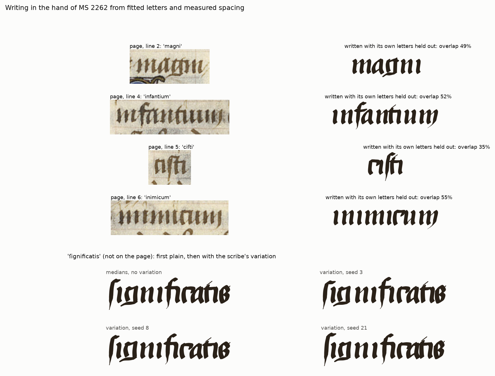

`scribe.py` writes words from the minim module, the fitted letters and spacing measured
on the page.

- **Spacing model.** Each pair of neighbouring letters inside a word (405 on the page)
  gives the distance between their left edges. That distance is modelled as an advance
  for the left letter plus an approach for the right one, so unseen pairs are spaced
  too.
- **Spacing variation.** The scatter left over (0.14 x-height) is mostly box-edge
  noise from the finder. The scribe's own spacing variation is taken from the
  between-letter stem pitch instead (±0.04 x-height).

**Held-out test.** Four page words made only of modelled letters are written again,
each with its own letters left out of every fit. Each is placed at its first letter
and compared with the ink.

| Word (line) | Overlap, held out | Overlap, nothing held out | Spacing error, worst letter |
|---|---|---|---|
| *magni* (2) | 49% | 54% | 4.0 px |
| *infantium* (4) | 52% | 56% | 5.4 px |
| *ciſti* (5) | 35% | 37% | 7.5 px |
| *inimicum* (6) | 55% | 56% | 3.3 px |

- **The models generalise.** Leaving a word's own letters out costs 0–5 points of
  overlap.
- **Placement, not shape, limits whole-word overlap.** A letter misplaced by 4–7 px,
  a quarter of an x-height, is enough to halve the overlap of a 7 px stem. The
  per-letter fits overlap 0.6–0.7.

***ſignificatis*** is not on the page.
- **Letter forms.** It starts with ſ, ends with the B-shaped final s, and keeps *-ti-*,
  as the scribe does (*ficentia, infantium*).
- **Versions.** It is written once from the medians and three times with the measured
  variation.

### The rest of the lowercase

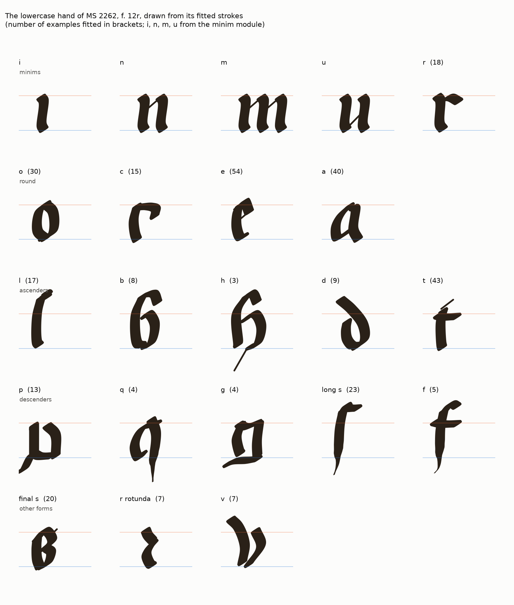

`textura.py` now fits a stroke plan to every lowercase letter on the page except the
single x. `hand.py` draws the whole alphabet and measures what the letters share.

| Letter | Strokes | Examples | Overlap | Width varies |
|---|---|---|---|---|
| o | left side, right side | 30 | 0.68 | ±8% |
| e | back, top stroke (to a horn, then down), hairline | 54 | 0.65 | ±7% |
| r | minim, shoulder | 18 | 0.65 | ±10% |
| ꝛ | head, spine and foot | 7 | 0.69 | ±5% |
| l | stem, head | 17 | 0.75 | ±8% |
| b | stem, head, bowl | 8 | 0.73 | ±9% |
| h | stem, head, leg, hairline tail | 3 | 0.64 | ±2% |
| d | bowl, back | 9 | 0.62 | ±9% |
| p | stem, bowl, base and descender | 13 | 0.72 | ±6% |
| q | bowl, stem | 4 | 0.76 | ±4% |
| v | left stroke, right stroke | 7 | 0.72 | ±7% |

What the letters show:

- **Three heights, and they are firm.**
  - x-band letters rise only a little above the x-line (1.05–1.15 x-heights; e's horn
    to 1.2) and sit a little below the baseline.
  - The ascenders l, b and h reach 1.7. The round d (1.5) and t (1.43) are shorter.
  - Descenders differ by letter: q goes deepest (0.75 below the baseline), then ſ
    (0.54) and f (0.46). p's descender is a short hairline lead-in (0.42), and g's tail
    lies almost flat on the baseline (0.31).
- **The ascender heads are not one shared part.** l curls only a little (0.19 x-height
  to the right of the stem), h more (0.37) and b most (0.50, a flag that meets the
  bowl). ſ and f share theirs (0.36). The parts library needs three heads, not one.
- **d has one form:** round-backed, its back leaning up to the left (9 of 9).
- **h ends in a long hairline** from the foot of its leg down to the left, below the
  baseline: the same corner-pen hairline as the joins.
- **v is a word-initial letter.** All 7 are word-initial. Its thick left stroke curls
  in from above the x-line, and its right stroke meets it in a point on the baseline.
- **Facing bowls bite.** On this page 25 of 26 pairs of facing bowls (*de*, *do*,
  *bo*, *pe*, *os* …) write the two sides as one stroke. A first count here said the
  opposite ("mostly pe; de, do, bo rarely touch"). It looked for a white column between
  the letters, and so took the counter inside a bowl for a gap. The whole book is
  measured in *Biting* below.
- **The positional rules hold without exception** on this page:
  - ꝛ only after o (7 of 7), straight r never after o (0 of 18);
  - ſ never at the end of a word (0 of 23), round s only there (22 of 22);
  - v only at the start of a word (7 of 7), u never there;
  - the z-shaped ꝫ only at a line end (2 of 2), m in full everywhere else (13).
- **e and ꝛ needed two fixes.** At first they fitted worst (0.49 and 0.45).
  - **The comparison window.** The letter finder's boxes for e often run into the stem
    of the next letter, and each ꝛ box starts inside the o it leans on. So the fits
    were charged for ink that isn't theirs. Each letter is now compared only within 4 px
    of its plan's columns. The window comes from the plan as drawn before fitting: cut to
    the fitted letter, a narrower letter could hide the ink it fails to cover, and e
    collapsed into a c with a nub.
  - **The plans.** Averaging all 59 e's showed the top stroke climbing thin to a horn
    1.2 x-heights up, then coming down thick to 0.8 as the right side of the eye; the
    hairline closes the eye from there. The first plan kept the top at the x-line.
    Averaging the 7 ꝛ's showed a straight left edge against the o and a longer, steeper
    top bar.
  - **Constraints.** e's points may move only 0.1 x-height, and its hairline is tied to
    the end of the top stroke. Left free, the fit shrank the top stroke to a nub, which
    overlaps the ink about as well and is the wrong letter.
  - **Result.** e fits at 0.65 over 54 examples (5 fused or crowded ones set aside),
    and ꝛ at 0.69. Straight r (0.57 → 0.65) and d (0.59 → 0.62) gained from the new
    window too.

### Capitals: painted initials and the scribe's own

The scribe writes no capitals inside the running text. Capitals come in two kinds, and
`capitals.py` surveys both over all 108 text pages of the book.

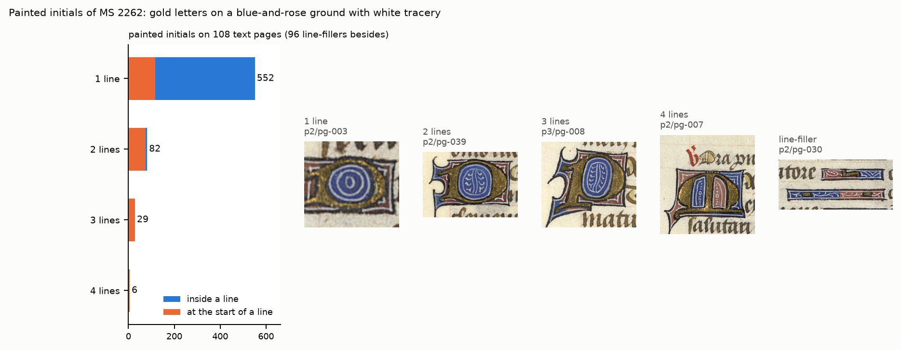

**Painted initials.** These are gold letters on a ground split into blue and rose,
with white tracery. Each counter is filled with the other colour and patterned with
rosettes, crosses, scrolls or fleurs-de-lis. They were painted after the writing, into
spaces the scribe left.

- **Four sizes, by function.**

  | Size | Initials | At the start of a line |
  |---|---|---|
  | 1 line | 552 | 117 |
  | 2 lines | 82 | 75 |
  | 3 lines | 29 | 29 |
  | 4 lines | 6 | 6 |

- **One-line initials mark verse starts, inside the running line.** 79% sit inside a
  line, because the text runs on: on f. 12r they are *[Q]uoniam, [E]x, [Q]uid,
  [M]inuisti, [O]mnia, [V]olucres, [D]omine*.
- **Larger initials begin sections at the start of a line.** These are psalms, hymns,
  lessons and hours. The four-line ones open the major offices, such as *Domine labia
  mea* at Matins on f. 11r.
- **Spacing.** About 7 initials fall on a typical page. 96 painted line-fillers close
  short lines, mostly in the litany.
- **What the editor must do.** Leave the space for an initial: one x-band-and-ascender
  box inside the line at a verse start, two to four whole lines at a section start.
  The initial itself is painting, not pen-work, so it belongs to a separate decoration
  layer.

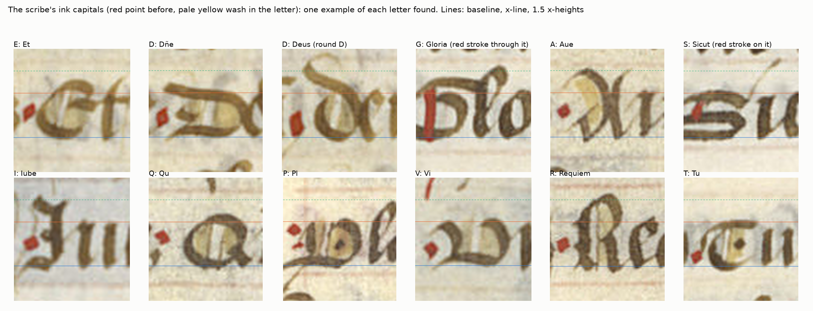

**The scribe's ink capitals.** These open the responses, versicles, doxologies and
prayers: *Et, Deus, Domine, Gloria, Ave, Sancta, Iube, Sicut, Requiem, Qui, Dum,
Iudica*. The rubricator marked each with a red point before it, sometimes with a red
stroke through the letter (the G of *Gloria*, the S of *Sicut*). The letter's counters
and strokes carry a pale yellow wash.

- **Finding them.** The rubricator's red is far stronger than the page's red ruling
  (a* about 48 against 20–30), so the red marks can be found. The yellow wash can't: on
  this scan it is barely yellower than the parchment and the ink's halo.
- **What the 60 red marks are.**

  | What follows the mark | Count |
  |---|---|
  | Capitals | 38 |
  | Lowercase words: *kyrie* (k), *xpe*, *ſancta*, *quam*, and cues like *an* and *ā* | 12 |
  | Other red: rubric fragments, ornaments, a lone point | 10 |

  So the red point marks a section start, not a capital as such. *Kyrie* and *Christe*
  keep their lowercase k and x.
- **Capitals found, with counts:** E 8 (all *Et*), D 5, G 5, S 4, I 4, Q 3, A 2, P 2,
  V 2, N 1, R 1, T 1.
- **Their forms are textura capitals built from the lowercase parts.**
  - E and G are broken round letters with a spur. E has a tongue, and G closes with a
    vertical.
  - D appears in two forms: a round D with its back curling up to the left (as in the
    lowercase d), and a D with a flat top stroke running out to the left.
  - S lies on its side, wider than it is tall.
  - Q is an O-like bowl with a tail. A has a curved left side and a straight right
    one. V is the word-initial v made larger.
  - Most add a thin vertical hairline inside the bowl (E, D, G, Q, T). The yellow wash
    is laid beside that hairline.
- **They are hardly taller than the lowercase.**
  - Measured over each capital's first 0.7 x-height of width, E reaches 0.96 x-height
    (median of 8).
  - Most others stay within 0.9–1.15.
  - Only I (1.46–1.65) and R (1.45) reach ascender height.
  - They are distinguished by width, the inner hairline, the red point and the yellow
    wash, not by height.
- **What the editor must do.** Model a capital as a lowercase-height broken letter
  with an inner hairline. Its colouring is a separate layer: a red point before it, an
  optional red stroke, and the yellow wash.

### Abbreviation signs and punctuation

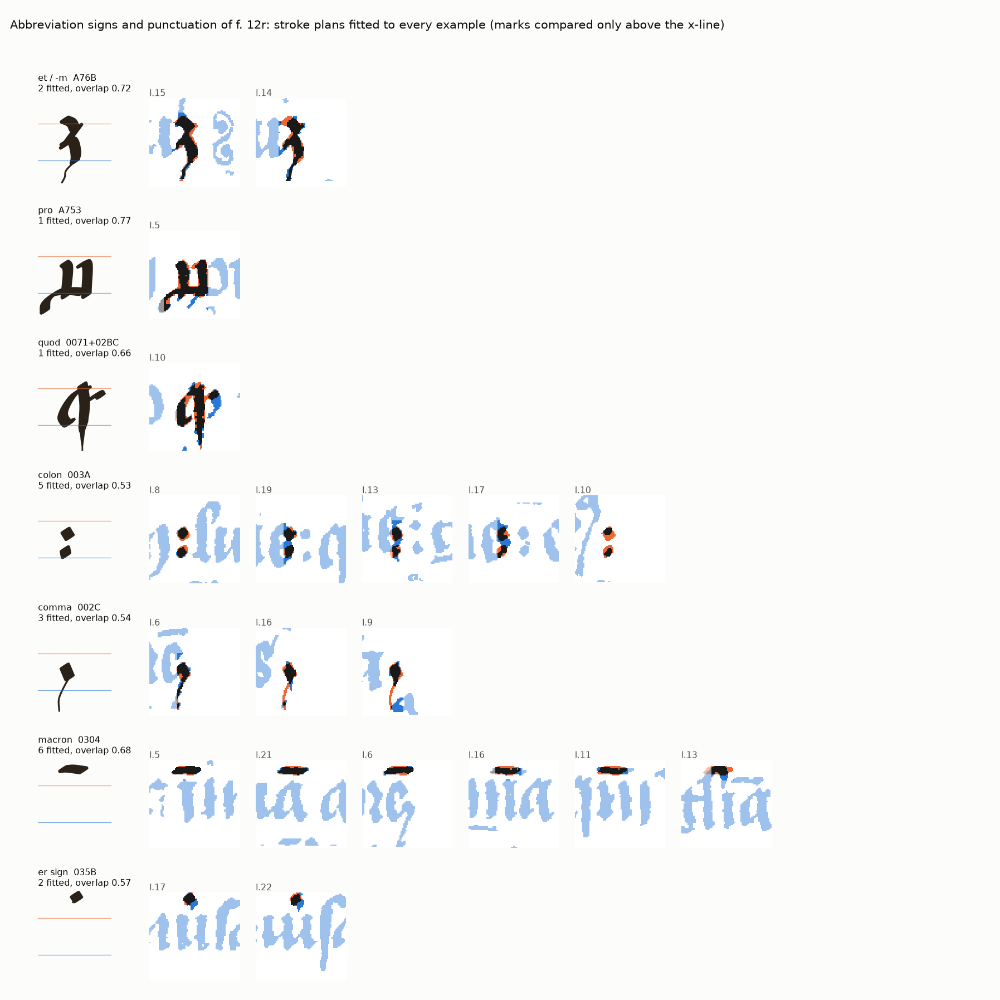

`abbrev.py` gives each sign on f. 12r a stroke plan and fits it like the letters. Marks
(the macron and the er sign) are fitted above the letter that carries them, compared
only in the band above the x-line. With 1–7 examples each, the fits mostly confirm and
adjust plans drawn from close-ups; the book's other pages hold hundreds more.

| Sign | On the page | MUFI 4.0 | Examples | Overlap |
|---|---|---|---|---|
| macron | a short thick bar about 1.45 x-heights up, over ī, ā, ē and the m of qm̄ | 0304 COMBINING MACRON | 6 (+1 set aside) | 0.68 |
| er sign | a small curl, like a question mark without its dot: in at the top, a swelling to the right, a thin tail down; above the u of *vniu[er]ſa* | 035B COMBINING ZIGZAG ABOVE, curly form (F1C8) | 3 | 0.53 |
| ꝫ | z-shaped: top bar, diagonal, small bowl, long hairline tail below the line | A76B LATIN SMALL LETTER ET | 2 | 0.72 |
| ꝓ | the p, its base running on under the stem into a hairline flourish | A753 P WITH FLOURISH | 1 | 0.77 |
| quod | q followed by a raised hook at its shoulder | q + 02BC MODIFIER LETTER APOSTROPHE | 1 | 0.66 |
| colon | two lozenges, at about 0.65 x-height and just above the baseline | 003A COLON | 5 | 0.53 |
| comma | a lozenge at mid-height with a long hairline tail below the line | 002C COMMA | 3 | 0.54 |

- **Quod is not ꝙ on this page.** My reading wrote ꝙ (A759, q with a diagonal stroke),
  but the scribe writes q and a raised hook. The reading keeps ꝙ as the word sign, and
  the model draws what is on the page.
- **The er sign is a curl, not a dot.** The first plan drew a lozenge with a short
  hairline, and at writing size it read as a dot. Redrawn as the curl it is (line 1
  shows it whole, 1.3–1.95 x-heights up; on lines 17 and 22 it is smaller, heavier and
  lower), it reads as the er sign in *vniu͛ſa*. The quod hook at the q's shoulder is the
  same movement, smaller.
- **The punctuation follows the chant.** The colon marks the mid-verse pause, where
  the psalm tone has its mediant, in 5 of the page's 7 full verses. The other two have
  no mark there: after *tuos* (line 5, at a line end) and after *noſter* (line 21). The
  comma-like mark ends a verse (*vltoꝛē, fundaſti*) or makes a flex before the pause
  (*pedibus*). MUFI's medieval punctuation offers closer encodings
  than colon and comma; which fits best is left until more of the book is read.
- **Shapes the ink mask can't confirm.** The er sign's tail and the colon's lower point
  are faint, so the fit is held close to the plan (0.1 and 0.06 x-height): left free,
  the curl vanished and the two points merged.

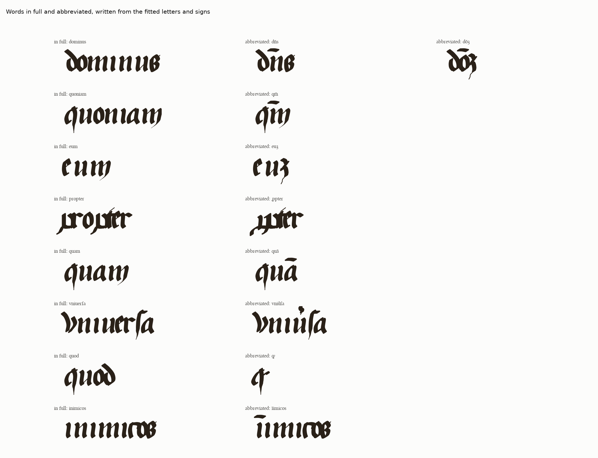

**Writing with them.** The writer now places marks over the letter before them and uses
the signs as letters, so a word can be written in full or abbreviated, as the scribe
chose by the space left in the line. The pairs above use the forms on f. 12r, and
*dn̄s* and *dōꝫ* for *dominus*. Spacing next to signs is still the general average where
the page has no example of the pair (the p's lead-in crowds the o in *propter*).

### Abbreviation follows the space left in the line

The scribe could write the same word several ways, and chose by the room left in the
line. f. 12r shows it directly:

| Word | Written in full | Abbreviated |
|---|---|---|
| *quoniam* | lines 2 and 7, first word | *qm̄*, line 11, second-to-last word |
| *eum* | line 12, first word; line 14, mid-line | *euꝫ*, line 14, last word |
| *eius* | line 17, first word | *e[ius]*, line 10, last word |

- **Abbreviations bunch towards line ends.** 12 of the 17 abbreviated words fall in
  the last two words of their line, where only about 40% of all words fall.
- **Some abbreviations are habitual.** *vniu[er]ſa* is abbreviated all three times,
  mid-line too. *ꝓpter*, *ꝙ*, *glīa* and *Omīa* are always short on this page.
- **What the writer needs.** It should choose between written forms per word: full,
  macron, ꝫ, suspension, ligature. It should fill each line to the ruled width,
  preferring the habitual forms always and the optional ones near the line end. The
  page gives the starting rates.

### Signs from the whole book: ꝯ, ꝝ, ꝫ, đ and the tilde

The book uses abbreviation signs that f. 12r lacks, or shows only once or twice. To fit
them, every text page (ff. 11r–64v) was read for them by eye.
- **The records:** 1,063 in all, of 29 kinds, in `data/hours_book_signs.jsonl`. Each
  gives the page, the sign's box, the word, its reading, and a note on anything unusual.
- **The checks:** every target sign was checked on contact sheets of its words.
- **The fit:** `book_signs.py` finds each example's line on its page (`hands.guides`),
  straightens it and rescales it to f. 12r's x-height. It then fits one stroke plan per
  sign with f. 12r's pen, like the lowercase letters.
- **Red ink:** signs the rubricator wrote in red are read from the red ink.

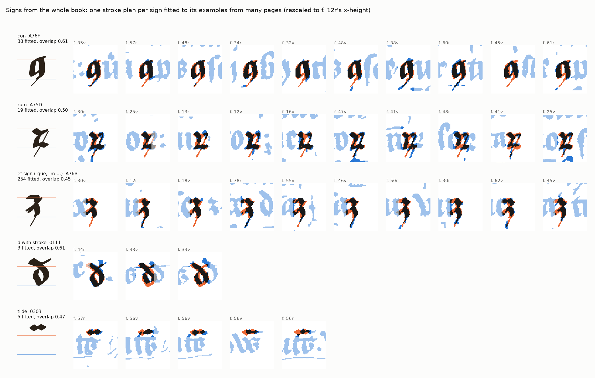

| Sign | MUFI 4.0 | In this hand | Fitted | Overlap | Width spread |
|---|---|---|---|---|---|
| con | A76F ꝯ | a 9: closed oval bowl in the upper x-height, stem down past the baseline into a hairline turning left | 38 (+4 another form) | 0.61 | ±0.09 |
| rum | A75D ꝝ | the r rotunda written as a z (top bar against the o, diagonal, foot), crossed by a long hairline down-left below the line | 19 | 0.50 | ±0.08 |
| et sign | A76B ꝫ | a z: point or short bar at the x-line, hairline diagonal, lower curve, hairline tail below the line | 254 (+5) | 0.45 | ±0.22 |
| d with stroke | 0111 đ | the round d with a thin stroke through its ascender, rising to the right | 3 | 0.60 | ±0.07 |
| tilde | 0303 ◌̃ | two lozenges side by side, each a short down-stroke of the broad nib, joined by a hairline; over s in *s̃* | 5 (+1) | 0.47 | ±0.06 |

**What the readings showed.**
- **The que sign is ꝫ.** After q the scribe writes the same z-shaped sign that stands
  for a final -m after a vowel (*meuꝫ*, *eaꝫ*, *tuuꝫ*). The two uses do not differ in
  shape or size: median width 1.10 of the plan for both, 56 and 175 examples. So ꝫ is
  fitted once, from all 259 uses, instead of f. 12r's two.
- **What ꝫ stands for depends on the letter before it.**
  - The commonest readings are those in `book_signs.SEMI_READINGS`: *qꝫ* -que, a
    vowel + ꝫ a final -m (190), *ſꝫ* sed (or scilicet), *dꝫ* debet, *bꝫ* -bus.
  - It also stands for *deus* (*dꝫ*, f. 61v), *laudet* (ff. 20v, 54v), *redimet*,
    *Emittet*, *licet*, *hic* and *Melchisedech*.
  - *uſꝫ* and *neꝫ* need no q at all.
- **Where the shapes come from.**
  - **đ:** only three are clear, and two of them are the rubricator's red *dd* (David,
    f. 33v). There the thin stroke runs through both ascenders. The third is *đ.* for
    *dei* (f. 44r).
  - **s̃:** it is in the cue lines of ff. 56r–57r (*ut s̃*, ut supra) and in a red *vs̃*
    (vesperas).
- **The same two-humped tilde stands over q for *quam*** (*q̃*, f. 33v, one line after
  *qᵃ*), so the form is the scribe's tilde generally, not one made for s.
- **The tilde is held near its drawn plan.** At this scan the waist between its two
  lozenges is a pixel or two, so the ink mask merges them. Fitted freely, the tilde
  became a single bar with a higher overlap (0.57) that misreads the page.
- **Spacing next to the signs is measured from the page.** f. 12r's pairs do not
  include these signs. For each example, the white gap between the sign and its
  neighbour, in the middle of the x-height band, gives the sign's approach or advance:
  the value at which the writer leaves the same gap (`out/hours_book_spacing.json`).
  The medians come from 252 examples for ꝫ, 19 for ꝝ and 36 for ꝯ.

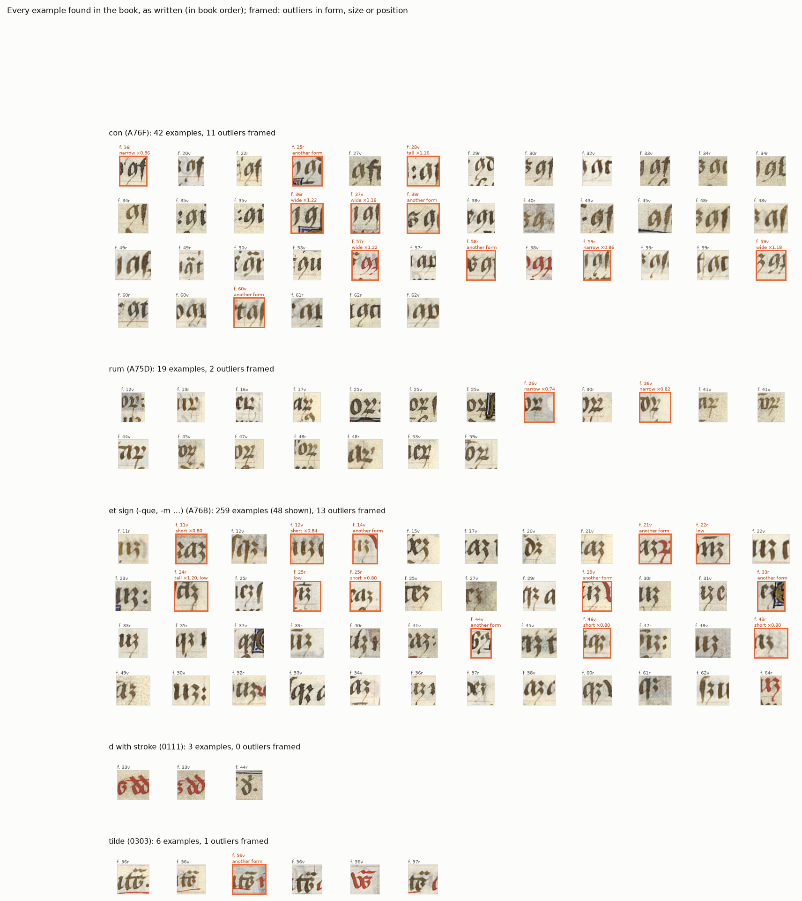

**Outliers in form.** These are framed above: set aside by the fit as another form,
more than 2.5 robust spreads from the median width or height, or sitting more than
0.2 x-height off the usual line.
- **ꝯ:** the fit set four aside.
  - In *ꝯceptus* (f. 38r) the bowl fills the whole x-height.
  - *ꝯſolatione* (f. 60v) is narrow, its bowl pressed against the ſ, with hardly any
    tail.
  - *ꝯfirmauit* (f. 58r) and *ꝯdēp|sis* (f. 25r) are ordinary 9s, set aside for faint
    ink and an offset box.
  - Separately, the readers found an a-shaped con with no tail below the line, readable
    only from the Latin (*ꝯgregationis* f. 48r, *ꝯpꝛehenderunt* f. 62v, *ꝯfirmāte*
    f. 64v).
  - With two lozenges above it, it stands for a whole word: *conspectu* (f. 49r),
    *contrarium* (f. 50v).
  - The rubricator writes it in red in *ꝯpletorium* (ff. 57r, 58v).
- **ꝝ:**
  - Its hairline sometimes drops almost vertically (*eoꝝ*, f. 12v).
  - It follows u, a and e as well as o (*auꝝ*, *tuaꝝ*, *mortifeꝝ*).
  - It stands once for -ris (*remīſcaꝝ*, f. 41v).
  - In the litany the same shape after ō is the plural *orate* (*ōꝝ*), where the
    singular *ora* is *ōꝛ*. On f. 42r orate is twice a quite different round-d-like sign
    with a separate curl.
- **ꝫ:**
  - Its width varies more than any letter's (0.75–1.4 of the plan), whatever it
    stands for.
  - It is sometimes split into its two parts, a true semicolon: *neq;* twice on
    f. 48v, *vſq;* f. 36v, *utiq;* f. 38v. Elsewhere *neqꝫ* is the z.
  - Once it is a closed 8 with no tail (*q8* = que, f. 25r).
  - With a macron over the q it is a whole word: *q̄ꝫ* = *quoniam* (f. 37v).
  - Standing alone for *et*, it is two wedges entered by a looped hairline from the
    left (ff. 15r, 17r, 18v), not the -m form.
- **ꝰ against ꝯ.** Written full size at a word's end (*numeꝰ* f. 15v, *fluctꝰ* f. 16v,
  *oībꝰ* f. 21r), the us sign is the same 9 as the con sign. Only its place in the word
  tells them apart.

**The same word abbreviated differently, close together.** This is the scribe fitting
the line:

| Word | Forms | Where |
|---|---|---|
| eorum | *eoꝝ*, in full, *eoruꝫ* | within three lines, f. 12v |
| conceptus, concepit | *ꝯceptus*, *cōcepit* | consecutive lines, f. 38r |
| tuum | *tuū*, *tuuꝫ* | f. 34r |
| quam | *qᵃ*, *q̃* | consecutive lines, f. 33v |
| dominus | *Dominꝰ*, *doꝰ* | one line, f. 23r |

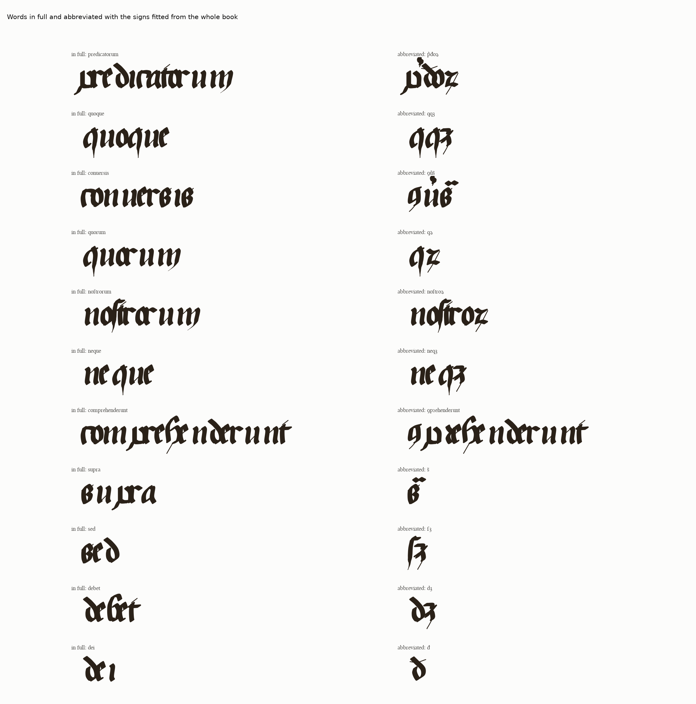

**Writing them.** The figure shows your examples in this hand, *p͛đoꝝ* (prædicatorum),
*qqꝫ* (quoque), *ꝯu͛s̃* (conuersis) and *qꝝ* (quorum), then forms found in the book:
*noſtroꝝ*, *neqꝫ*, *ꝯpꝛehenderunt*, *s̃*, *ſꝫ*, *dꝫ*, *đ*. con written as *cō-*, the
scribe's other way (five clear cases and three likely, often at line ends), needs no new sign: it is c and o
with the fitted macron. The hand file (`out/hands/ms2262_A.json`) now carries the new
signs and their spacing.

### Biting: facing sides written as one stroke

When a letter's right side is upright and the next letter's left side is too, a
textura scribe can write the two as one stroke. The letters "bite", sometimes several
in a row, most of all where the strokes are the sides of bowls. o + p + p + o can fuse
all along, and o + c bites, but r + a does not: r has no upright right side to share.

**How it was measured.**
- **Readings.** Thirteen pages spread through the book (f. 12r and ff. 13v, 18v, 23v,
  26r, 29r, 33r, 39v, 47v, 50r, 52v, 58v, 62v) were read letter by letter into
  `data/hours_readings.json`, which also keeps the readers' notes on doubtful lines.
- **Letter positions.** `find_letters.py` lays each line's reading along its ink, as
  `align.py` does for f. 12r, with f. 12r's templates and the book's own sign
  examples, on lines straightened and rescaled to f. 12r's x-height. Of the minim
  letters (i, n, m, u) it finds, 1,974 of 1,992 hold exactly their stems (at least 98%
  on every page), the same check f. 12r passes.
- **The junction.** `biting.py` looks at each pair of neighbouring letters inside a
  word. The left letter's last upright stroke and the right letter's first are found
  where the fitted letters put them, in the middle of the x-height band. The pair is:
  - **bitten** if the two are one stroke (no wider than 1.5 strokes);
  - **fused** if they are one run but wider (two strokes run together);
  - **linked** if they are two strokes joined only by a hairline;
  - **separate** if white crosses between them over the whole x-height.

  A white column only counts as a gap if it is white over nearly the whole x-height:
  the counter of a bowl always has the bowl's top or bottom stroke in it, even where
  this scribe leaves the p's bowl open at the foot.
- **Sides.** Each letter turns a *bowl* (o, b, d, p, g, h's leg, s), a *stem* (minims,
  a, l, q) or an *open* side (c, e, r, t, f, ſ, ꝛ …) to its neighbour. A letter with an
  open side can only touch.

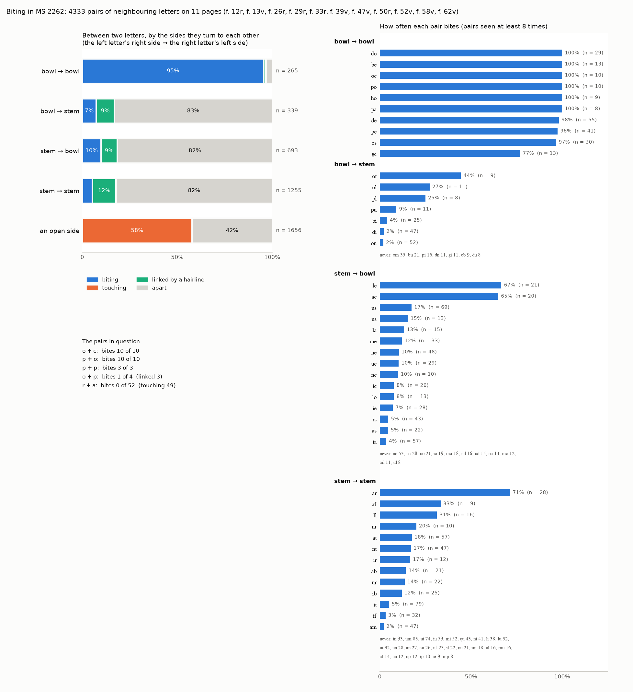

| Facing sides | Pairs | Bite | Examples |
|---|---|---|---|
| bowl → bowl | 327 | 95% | *do* 45/45, *be* 17/17, *oc* 11/11, *ho* 11/11, *po* 10/10, *pa* 12/13, *de* 64/65, *pe* 44/46, *os* 32/33, *ge* 12/15 |
| bowl → stem | 415 | 7% | *pp* 3/3, *ot* 4/10, *ol* 3/13, *pl* 2/8, *op* 2/6; before a minim almost never (*on* 1/57, *di* 1/61, *om* 0/53, *bu* 0/26) |
| stem → bowl | 815 | 9% | *le* 14/23, *ac* 15/22; a minim before e about one time in ten (*ne* 6/56, *me* 4/35, *ue* 4/34) |
| stem → stem | 1,471 | 6% | *ar* 23/32, *ll* 5/17, *at* 15/67, *nt* 12/59; minims never (*in* 0/117, *um* 0/94, *ui* 0/83, *mi* 0/72) |
| an open side | 1,916 | never | 58% touch at the head or foot: *ra* 0/58 (55 touch), *te* 0/91, *ce* 0/36, *ſt* 0/57 |

- **Bowls bite.** Two facing bowls are written on one line 95 times in 100, and at least
  9 times in 10 on every page sampled. Of the 16 that do not, 6 involve a g, whose bowl
  hangs from its stem and stands apart (*ge*, *go*, *ga*, *og*).
- **A bowl against a stem bites only where the stem is tall or a p's.** o + t, o + l and
  p + l bite now and then, and p + p always. o + p bites twice in six; the other four
  times the o's side and the p's stem stand side by side, linked by a hairline.
  So in *o p p o* this scribe fuses the p's and the p with the o, but not the first o
  with the p.
- **Minims never share a stroke.** Sharing one would turn *um* into *un*. But r is
  built straight onto a's stem (*ar* 23 of 32), and e and c lean their backs on l and a
  (*le*, *ac*).
- **r rotunda is the other way of joining.** After o the scribe always writes ꝛ, which
  hooks its head onto the o's side instead of sharing it: *oꝛ* 0 of 58 share a side, 14
  touch.
- **Chains.** 27 runs of three or more letters each bite the next: *ꝓpt*, *ppa*, *opt*,
  *pot*, *pac*, *hoc*, *doc*, *odo*, *dde*, *oll*, *loc*, *llat* …
- **How far they overlap.** The shared run is 9 px wide at the median (one stroke is 7):
  398 of 496 biting pairs share one stroke, 98 run two strokes together.

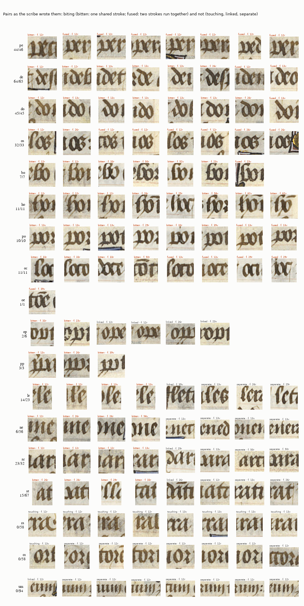

**The writer bites as the scribe does** (`scribe.Scribe.bite_distance`). For each pair
it takes the scribe's rate: the pair's own where the pair occurs at least five times,
otherwise its facing sides'. When the pair bites, the second letter is placed so that
its first upright stroke lies on the first letter's last one; the offsets come from the
fitted letters, plus the measured overlap. Pairs that do not bite keep the spacing
model. The rates travel in the hand file.

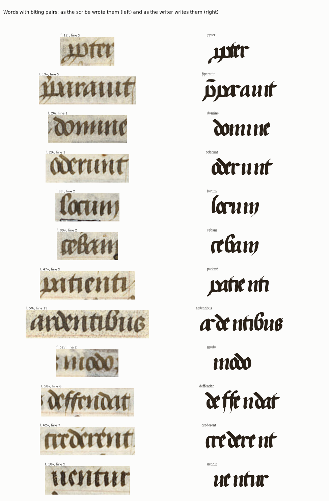

### Accents: anchors on the letters, marks in the scribe's manner

Letters with accents and other marks make up the largest group of MUFI characters still
missing: 276 are one of twenty base letters with one of some thirty marks, singly or
stacked two or three high. Old Norse and Icelandic texts are full of them (á, é, ó, ú,
ǫ, ǿ, ǭ, ǫ́ …). Latin has ę, and the vernaculars have â, ü and ŏ. A font draws each mark
once and puts it on any letter by *anchors*. A point on the base (top, bottom …) and a
point on the mark (its foot, its top …) are made to coincide, and a mark's own top
carries the next mark (mark-to-mark). `anchors.py` builds the same scheme from this
hand: the anchors come from the letters' ink, the placement from where this scribe puts
his marks, and the marks from strokes he already makes.

**Anchors from the letters' own ink.** Every letter the writer has is drawn alone, with
the hand's pen and without variation, and its anchors are read off the ink:

| Anchor | Where | For |
|---|---|---|
| top | the middle of the body at its top; on b d h l ſ f, the top of the ascender | marks above |
| bottom | the middle of the body's foot (h's hairline tail aside); on g p q ſ f, the descender's end | marks below |
| ogonek | where the letter leaves the baseline on the right | ogonek |
| middle | the middle of the body at half the x-height | ø, ʉ, ɨ, ł, ꝟ |
| bar | through the ascender at 1.2 x-heights, where the scribe crosses his đ | ð, ƀ, ħ |
| cross | across the ascender near its top, where he bars l for *-or-* (gl̄ia) and h, b in *ih̄s*, *nob̄* | the macron over an ascender, ꝉ |
| desc | through the descender | ꝑ, ꝗ, ǥ |
| top_right | over the right shoulder | comma above right, slashes above right |
| high | above the ascender line (1.64 x-heights) whatever the letter | MUFI's "high" marks |

**Where the scribe puts his marks.** The 12 pages read for the biting study carry 216
marks over found letters. The mark is the ink component nearest the letter's middle
lying wholly above the x-height, below the line above's descenders. 187 are found. Over
the x-height letters there are 175 (167 macrons, 8 er curls):
- **The mark's foot sits 0.12 x-height above the letter's top** (spread 0.10). That is
  1.18 x-heights above the baseline, lower than the macrons fitted on f. 12r.
- **Marks drift to the right of the body's middle** by 0.09 x-height in all, with a
  spread of 0.12 over the minim letters, whose boxes are held to their stems. The drift
  depends on the letter:

  | | i | u | o | m | n | r | p |
  |---|---|---|---|---|---|---|---|
  | marks | 48 | 26 | 13 | 14 | 28 | 14 | 11 |
  | drift (x-heights) | +0.05 | +0.03 | −0.04 | +0.10 | +0.21 | +0.24 | +0.26 |

  Over r, p and n the bar leans towards the next letter. The writer uses a letter's own
  drift where it has at least ten measured marks, and the overall median elsewhere.
- **Over an ascender the scribe crosses rather than sits above.** The writer's macron
  and overline do the same. MUFI's "high" marks and its accents sit above.

**Marks from the scribe's own strokes.** MS 2262 has no accents, so they are designed
from the four things this scribe does with his pen beside the letters:

| Made from | Marks |
|---|---|
| fitted marks (4) | the macron, the tilde and the er curl as fitted; đ's crossing hairline for every bar through a letter |
| the fitted marks, reused (14) | overline and the fixed-height macrons and overlines (the macron's bar), double overline, bar with dot, macron below, low line, double low line; hook above, MUFI's curl and its high form (the er curl at ¾ size), the er curl's MUFI form F1C8; comma above right (his comma at 0.4) |
| his point (6) | dot above and below, its high form, diaeresis above and below, diagonal diaeresis: the colon's point (the nib drawn down to the right) at 0.6 size |
| the pen's edge (8) | acute and double acute (a short steep stroke up to the right: a slim wedge with this 33° nib), circumflex and its double form, caron, zigzag above and below; the grave (below) |
| the pen's corner, as a hairline (16) | breve, ring above and below, vertical line(s), vertical tilde, curly bar, inverted breve below, double breve below, asterisk below, ogonek and ogonek above, cedilla, slashes and strokes |

- **The nib decides several shapes.** Drawn up to the right at 60°, the nib makes the
  slim wedge of an acute. Drawn down to the right it makes a heavy lozenge, which is
  how the point is made, so a grave drawn that way would read as a dot. The grave is
  therefore a small point with a hairline running down from it, the scribe's comma
  turned over.
- **Only the corner can draw thin uprights and small rounds.** The nib's edge fills a
  ring or a breve solid, so these are corner hairlines, like the er tail and đ's stroke.
- **Stacking.** A second mark on the same anchor sits on the first one's top at 0.6 of
  the gap (ǭ, ǫ́, ę with ogonek, dot and acute).
- **Decomposing characters.** Precomposed characters are taken apart in three ways:
  - by Unicode's decomposition (á, ǫ, ǭ);
  - for letters whose stroke Unicode keeps whole, by a small table (ø ł đ ð ħ ƀ ꝑ ꝗ ꝉ …);
  - for MUFI's Private Use Area letters, by their names ("LATIN SMALL LETTER O WITH
    OGONEK AND DOT ABOVE AND ACUTE": o + ogonek + dot above + acute, the first named
    nearest the letter). MUFI's "variant letter forms" with a curl are other shapes of
    the letter, not a mark, and are left out.

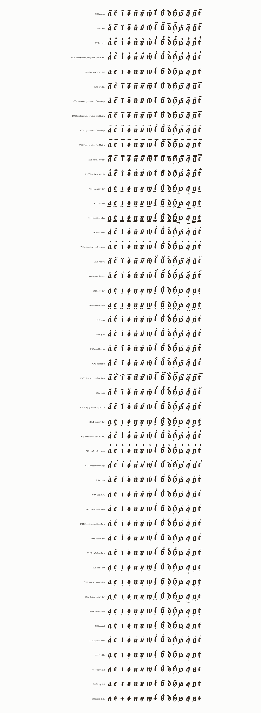

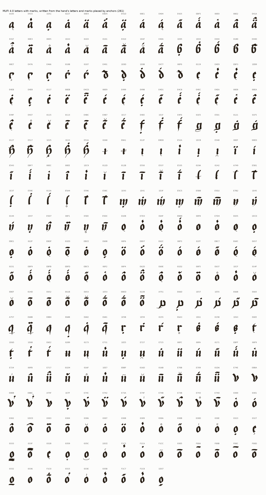

**What the writer writes now.** 258 MUFI characters are written from a fitted letter
and its marks: 222 letters (ð among them, as d with đ's stroke) and 36 combining marks.
The specimen above adds the three fitted marks (261). Before, 8 letters with fitted
marks were ready. The anchors reproduce the page's own
abbreviations as the fitted positions did (dn̄s, qm̄, vniu͛ſa, h̄itant). Placement varies
by the measured spreads, as the letters do.

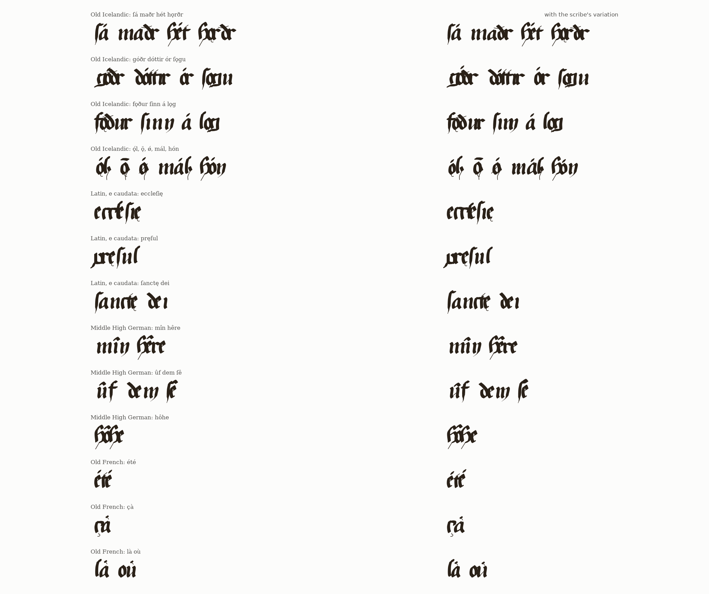

### One scribe or several?

A book of hours was often shared out among several scribes trained in the same
tradition, to save time. Their stints then differ in small, steady ways, often changing
at a quire. The editor should be able to write each of them, so the book was searched
for such changes, first page-wide and then letter by letter.

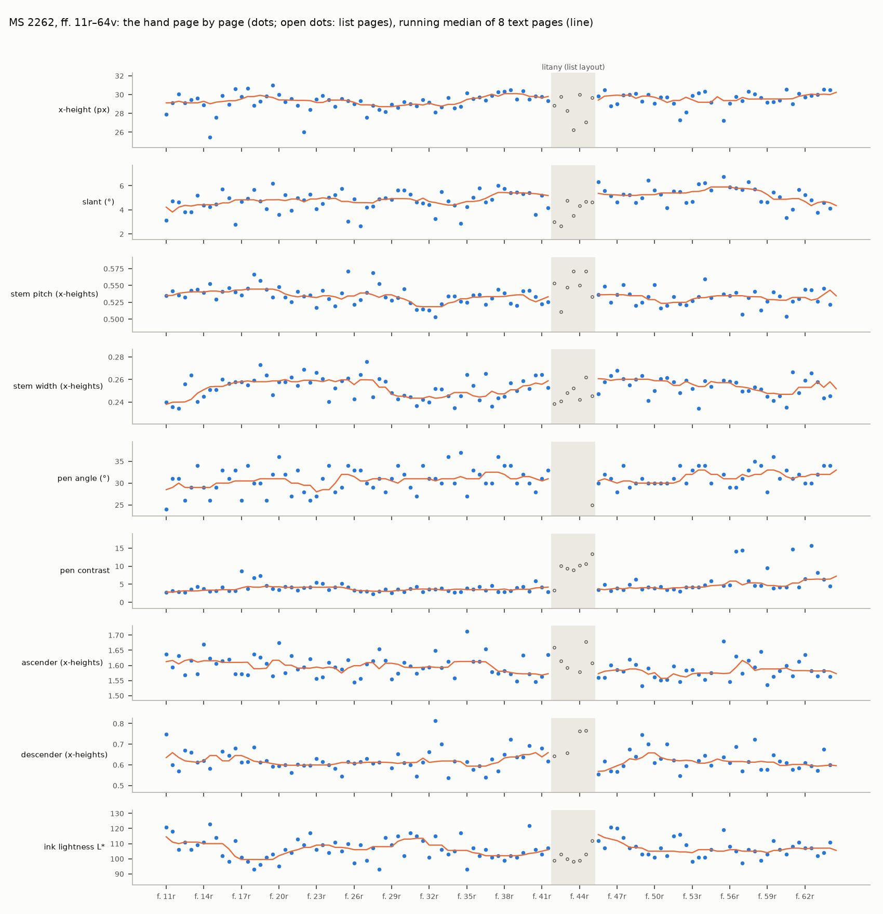

**Page by page.** `hands.py` measures all 108 text pages of the PDF (ff. 11r–64v) in the
same way: x-height and ruling, slant, minim rhythm, stem weight, the fitted pen, reach
of ascenders and descenders, and the ink. Red ink and painted initials are removed
first. 106 pages measure; 2 have too few lines. On the 99 text pages, half the pages
lie within these bands:

| Measure | Median | Middle half spans | Range |
|---|---|---|---|
| x-height | 29.5 px | 0.95 px | 25.4–31.0 |
| x-height / line pitch | 0.50 | 0.015 | 0.44–0.53 |
| slant | 5.0° | 1.1° | 2.7–6.7 |
| stem pitch | 0.534 x-heights | 0.016 | 0.504–0.571 |
| stem width | 0.255 x-heights | 0.014 | 0.234–0.276 |
| pen angle | 31° | 3.5° | 24–37 |
| ascender | 1.59 x-heights | 0.05 | 1.53–1.71 |
| descender | 0.61 x-heights | 0.05 | 0.54–0.81 |

- **One run stands out, and it is layout.** ff. 42r–45r are the litany: "Sancte
  Bartholomee — oꝛ̃", short invocations each closed by a painted line-filler, with a
  column of one-line initials. There the fitted pen falls to 9–25° and its contrast
  jumps to 9–13. The fillers' outlines and the stacked initials cause that, not another
  pen. These pages (five or more line-fillers each in the capitals survey) are marked
  and left out.
- **No boundary between text pages moves a measure of the hand by more than 2.3
  times its page-to-page noise.** That is the median of 8 pages either side of each
  boundary, compared. Slant drifts up by about a degree over ff. 38–58 and back.
  Stem width wanders by 0.02 x-heights. Ink lightness moves in runs of pages: ink
  batches, not scribes.
- **The pen contrast rises in the last quires** (ff. 54–64), with four pages at 14–16.
  Close-ups of those pages (the Hours of the Cross, the prayers, the Gospel sequences)
  show the same letterforms and the same ink capitals with their inner hairline. In
  close-up the strokes look more transparent (their median colour hardly changes). The
  likely cause is that faint hairlines drop out of the ink mask, which raises the fitted
  thick-to-thin ratio.

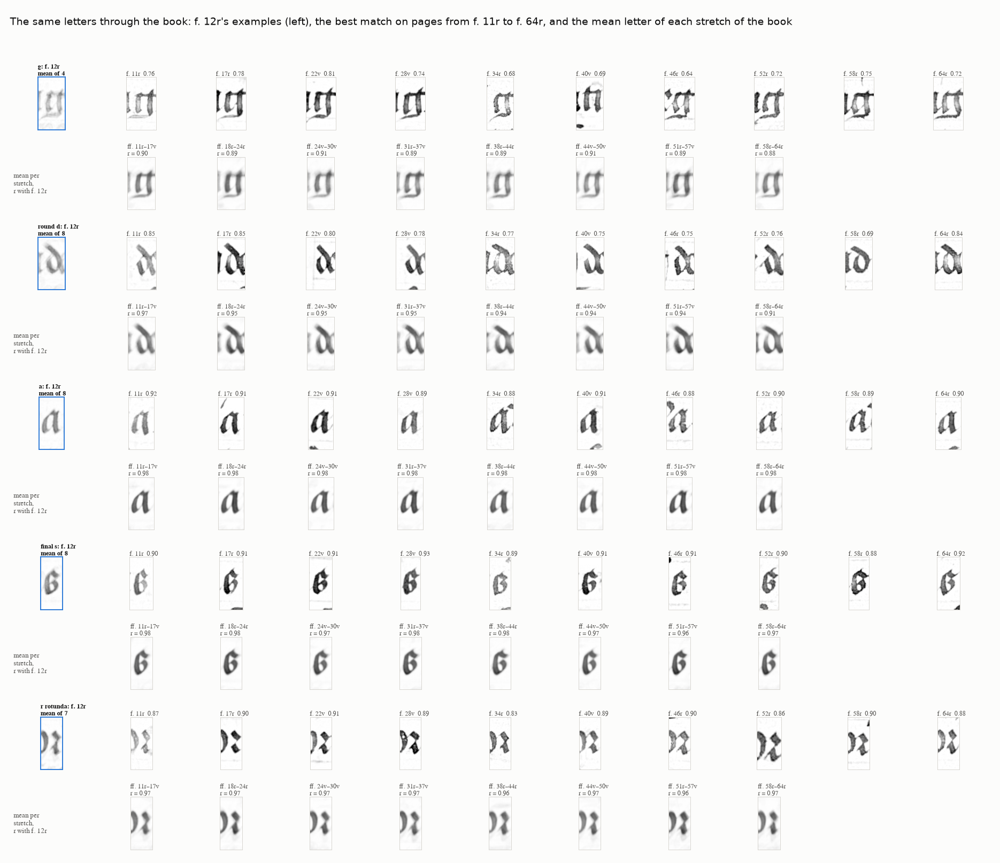

**Letter by letter.** Scribes of one tradition are usually told apart by small habits
in particular letters, so `forms.py` follows five of them through the book:
- how g closes its tail;
- the lean of round d's back;
- the head of a;
- the B-shaped final s;
- ꝛ after o.

Each example of the letter on f. 12r (up to the eight most typical) is matched by
correlation over every page. The match is scored separately in the ascender, x-height
and descender bands, and the weakest band decides. That way a g must have a g's tail
and an a nothing above or below it, and the minim rhythm all textura letters share
cannot decide the match. Whole words were tried first: most words of f. 12r are absent
from most pages, and their best matches were only look-alikes.

The best matches are averaged per eighth of the book (about 13 pages each). Three pages
with fewer than ten lines are left out (ff. 34v, 55r, 64v).

| Letter | Mean letter of each eighth vs f. 12r's (r) | Match score per eighth |
|---|---|---|
| a | 0.976–0.981 | 0.89–0.90 |
| final s | 0.965–0.978 | 0.89–0.91 |
| ꝛ | 0.956–0.975 | 0.85–0.89 |
| round d | 0.911–0.966 | 0.74–0.79 |
| g | 0.878–0.909 | 0.67–0.72 |

- **No stretch of the book stands apart.** Against the mean of the other seven eighths,
  each eighth's mean letter scores r = 0.98–0.997 (round d in the last eighth 0.96).
  Match scores per eighth differ by at most 0.05.
- **Round d drifts a little.** Its mean letter moves from r = 0.97 to 0.91 by the last
  eighth (ff. 58r–64r): a slow change in one letter, not a break.
- **Conclusion: one scribe wrote ff. 11–64 of this copy,** as far as size, pen, rhythm
  and these five letters show. The calendar (ff. 1–10) and any missing quires were not
  compared. The variation that remains (page to page, and the slow drifts in slant and
  in d) is one scribe's, which the model keeps as its variation.

### One file per hand

So that the editor can write any number of scribes, `bundle.py` saves all that the writer
needs for one hand in one file (`out/hands/ms2262_A.json`, 80 kB):
- the pen at the page's x-height: nib size, angle and corner sharpness;
- the slant and the twist-and-pull terminal;
- the minim module, with its joins, pitch and tail, and the minim letters' offsets;
- the spacing model;
- every fitted letter and sign, each with its examples' spread in width and height;
- the biting rates;
- the letters' anchors, the marks and the scribe's placement of them;
- where it came from: folios, and the number of examples per letter.

`Scribe.from_bundle(path)` writes from that file alone. For f. 12r it draws exactly what
the writer built from the separate fits draws: no pixel differs in *ſignificatis*,
*dn̄s*, *vniu͛ſa*, *hǫrðr* or *pręſul*. A second scribe means running the same fits on that scribe's pages
and saving a second file; the writer does not change. MS 2262 shows one hand on
ff. 11–64, so it has one file.

**Run order** for this page (each step reads the previous ones' outputs):

```sh
python3 latin_lines.py hours      # line guides, slant, pen
python3 letterforms.py            # letterform atlas, minim rhythm
python3 twist.py                  # twist-and-pull tails
python3 minims.py                 # minim module, joins, minim spacing, 'minimum'
python3 corners.py                # nib corner test (about 5 minutes)
python3 align.py                  # find every letter on the page
python3 textura.py                # fit the other letters' stroke plans
python3 scribe.py                 # held-out test and 'ſignificatis'
python3 hand.py                   # the alphabet, heights, heads, biting, positional rules
python3 abbrev.py                 # abbreviation signs, marks, punctuation; words full and abbreviated
python3 capitals.py PDF_PAGE_DIR  # painted initials and ink capitals, whole book
python3 measure_letters.py hours  # the traced 'nomen'
python3 hands.py PDF_PAGE_DIR     # the hand page by page, whole book (about 15 minutes)
python3 forms.py PDF_PAGE_DIR     # the same letters through the book (about 10 minutes, 4 cores)
python3 book_signs.py PDF_PAGE_DIR  # ꝯ, ꝝ, ꝫ, đ, tilde from the whole book (reads data/hours_book_signs.jsonl)
python3 find_letters.py PDF_PAGE_DIR  # letters of the pages read in data/hours_readings.json
python3 biting.py PDF_PAGE_DIR    # biting on those pages and f. 12r; the writer's biting rates
python3 anchors.py PDF_PAGE_DIR   # letters' anchors, the marks, where the scribe puts them
python3 bundle.py ms2262_A 12r    # save the fitted hand as one file
```

### Limits

- **One page analysed in depth.** The book's other text pages (about a hundred) are
  measured page-wide and letter by letter (*One scribe or several?*), but the letters
  are fitted on f. 12r alone.
- **Not every form is modelled yet.**
  - Every lowercase letter on f. 12r is fitted except x (one example).
  - The abbreviation signs rest on 1–7 examples each; the rest of the book would
    give many more.
  - The signs fitted from the whole book rest on 3–259 examples (*Signs from the whole
    book*): đ on three, the tilde on five. The readers' boxes are good to about ±4 px.
    Only examples marked "sure" are fitted. The counts of the minor signs (ꝰ, ꝑ, ꝓ,
    superscripts) are not exhaustive.
  - Other signs recorded but not yet fitted: ꝰ (us, 60 sure), ꝑ (per, 30), ꝓ (pro,
    26), standalone et (27), the barred l of the Kyrie and litany responses, superscript
    letters.
  - The ink capitals are described, not yet fitted, and the painted initials are not
    modelled.
  - The accents are designed, not fitted: MS 2262 has none. The placement is measured
    on macrons and er curls only, and the gap between stacked marks is a choice (0.6 of
    the gap above a letter). Marks under descenders, and above ascenders, follow font
    practice, not this scribe.
- **Corners are at the limit of the scan.** At 29 px to the x-height, the difference
  between a squared and a fully sharp nib corner is a few hundredths of a pixel on
  average (see *The pen's corners*).
- **Letter boxes are approximate.** Positions in the atlas were read by eye (±2 px).
  The transcription hasn't been checked against a printed edition or catalogue.
- **The library's own description of MS 2262 wasn't found** online from here. The
  dating above rests on the calendar and the style alone.

## End goal: the MUFI character set

The editor should be able to write every character of the MUFI character
recommendation, version 4.0 (Medieval Unicode Font Initiative, 2015; `MUFI v4.0.pdf`
on the master branch), in the hand being modelled. MUFI lists the characters needed to
transcribe medieval Latin-script texts:
- base letters with their accents, dots, hooks and bars;
- ligatures, superscript letters and variant forms;
- numerals, combining marks and abbreviation signs;
- punctuation, symbols, and geometrical and metrical signs.

Each comes with a code point, either in Unicode or in the Private Use Area. Most have
never been written in this hand, so many shapes will have to be improvised in its manner.

`mufi.py` parses the PDF's text into `data/mufi4.json`: 1,522 rows and 1,514 code
points (MUFI states 1,512), 738 of them in the Private Use Area. It then sorts every
character by what writing it needs. This is a first pass, from the names and Unicode
decompositions.

| Class | What it needs | Characters |
|---|---|---|
| fitted | fitted on f. 12r: 22 letters (with dotless ı, as this scribe writes i), ꝓ, macron, er sign, colon, comma; from the whole book: ꝯ, ꝝ, ꝫ, đ, tilde | 33 |
| composed, written | a fitted letter with marks placed by its anchors (*Accents*), and the combining marks themselves | 258 |
| composed | a fitted letter with a modification still to design: tails, hooks and long legs (ɖ ɦ ƞ ɲ ꝕ ɼ), q ligated with ꝛ or ꝫ, ꝙ, superscript letters as marks (ur, us, is, ra), a triple breve | 19 |
| derived | built from fitted letters: capitals, small capitals, ligatures, superscript, enlarged and variant forms | 650 |
| new | no fitted base: other letters, numerals, punctuation, symbols | 562 |

**Suggested order**, by what each step opens up:

1. **The common marks: done** (*Accents: anchors on the letters, marks in the scribe's
   manner*). 48 marks on anchors open 258 characters. Before, 8 were ready.
2. **Capitals.** The scribe's ink capitals are lowercase-height broken letters with an
   inner hairline. Twelve are attested in the book (E, D, G, S, I, Q, A, P, V, R, T, N):
   fit those, and build the rest the same way. With small capitals, capitals carry
   most of the 650 derived characters.
3. **Ligatures and superscripts** from fitted letters, with the shared strokes the
   scribe uses when facing bowls bite.
4. **Missing letters.** By the characters each opens: y 54, j 30, k 28, w 28, z 13, x 10.
   k and x occur in the book (*kyrie*, *xpe*) and can be fitted. Then the letters with
   no Latin model in this hand: thorn, wynn, yogh and the insular forms (eth is written
   as d with đ's stroke). Old Icelandic needs þ, æ, y and k next: with them and the
   marks, most of its words can be written.
5. **Numerals, punctuation and symbols.** The calendar's red roman numerals can be
   fitted; the rest are designed.

Recorded in `out/mufi_coverage.json`, and re-counted whenever more is fitted:
```sh
pdftotext -layout "MUFI v4.0.pdf" mufi.txt && python3 mufi.py mufi.txt
```

## The four hands compared


`compare.py` measures the pen on all four pages with the same method (ink across the
stroke, divided by the page's median).

| | Hijazi reed (Arabe 328) | Humanist cursive (Lucretius) | Italian rotunda (Chigi) | French textura (MS 2262) |
|---|---|---|---|---|
| Thick/thin contrast | 1.18 | 1.31 (poor single-nib fit) | **2.89** | **2.64** |
| Thinnest stroke direction | 44° | 16° (unclear) | 24° | 34° |
| Slant of uprights | 25–34°, alif ≈ 9° more than lām | 14.8° | upright (−0.3°) | 4.8° |
| Where variation lives | shared by each word (size r = 0.97) | within lines, not between | within lines, not between | within lines, not between |
| Line spacing | — | 3.4 x-heights | 4.0 x-heights | 1.9 x-heights |
| Ascender above baseline | alif ≈ 7.8 stroke widths | 2.0 x-heights | 2.5 x-heights | 1.6 x-heights |
| Stem pitch (at 14 px x-height) | — | 0.77 x-heights | 0.76 x-heights | **0.54 x-heights** |

What this means for the editor:

- **One renderer can serve all four hands.** A swept nib with three settings (size,
  contrast, angle) produces the near-monoline reed, the light humanist pen and both
  broad Gothic nibs. Hairline tails and joins are drawn with the pen's corner
  (`pen.is_corner_stroke`).
- **Some hands need more than angle.** The cursive needs an extra up-/downstroke
  (pressure) setting, which the traced stroke direction supplies.
- **Each hand varies at a different level.** The Hijazi scribe varies whole words; the
  three Latin scribes hold the page steady and vary within lines. The variation model
  needs a level setting per style.
- **A style is also a set of spacing targets.** Stem pitch and its evenness tell the
  textura apart from the rotunda and the cursive more clearly than any single letter
  shape. Layout should be driven by these numbers, not by fixed glyph widths.
- **Every style needs a text step before drawing.** These all sit between the reading
  and the strokes:
  - contextual letter forms (the Chigi *ta*; the textura's ꝛ after o, ſ inside words
    and s at the end, v at the start of a word, fused *de/bo/pe*);
  - abbreviations (the Lucretius ꝑ and q;, the textura's macrons and ꝙ, ꝓ, ꝫ);
  - early spelling (Hijazi short spellings, Tuscan ç/ngn).

## Sources

- The Arabic page image is from Gallica: Source gallica.bnf.fr / Bibliothèque nationale
  de France, Département des Manuscrits, Arabe 328. Gallica permits free non-commercial
  reuse with this attribution. Check the BnF terms before any commercial use.
- The Chigi page is a detail of Città del Vaticano, Biblioteca Apostolica Vaticana,
  Chig. L.VIII.305, f. 1r (DigiVatLib, with the Library's watermark). Check the BAV's
  terms before any reuse beyond study.
- The Book of Hours is Clermont-Ferrand, Bibliothèque du Patrimoine (Clermont Auvergne
  Métropole), MS 2262, from the digitisation published on Wikimedia Commons
  (`FR-631136102_MS_2262_Book_of_Hours.pdf`). Check the file page's licence before
  reuse.
- The Lucretius page image was supplied with this project. Its holding library and
  reuse terms still need to be recorded here.
